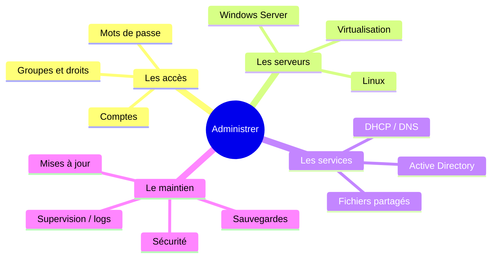

# Administration 01 — C'est quoi administrer

🕐 Lecture : ~6 min · Niveau : débutant

---

## 🏢 L'analogie du quotidien

**Construire** un immeuble et le **gérer** sont deux métiers différents. L'installation,
c'est le chantier (poser les câbles, brancher la box). L'**administration**, c'est le
**gestionnaire de l'immeuble** une fois qu'on y habite :

- Il distribue et reprend les **clés** (comptes, droits).
- Il entretient les **parties communes** (serveurs, services).
- Il surveille que **tout fonctionne** et que **personne n'entre où il ne doit pas**.
- Il gère les **incidents** et les **travaux** (mises à jour, sauvegardes).

C'est ça, ton rôle d'infogéreur au quotidien : **gérer la vie du système**.

---

## 🎯 Les 4 grandes familles de tâches

---

## 🧰 Tes outils d'administrateur

Selon le système, tu travailles avec :

| | **Windows Server** | **Linux serveur** |
|---|---|---|
| En clic (graphique) | **Gestionnaire de serveur**, consoles MMC | interface web (selon l'appli) |
| En ligne de commande | **PowerShell** | **le terminal / shell** (bash) |
| À distance | **RDP** (Bureau à distance) | **SSH** (console sécurisée) |

> 💡 Au début on administre « en cliquant ». Avec l'expérience, on passe en **ligne de
> commande** : plus rapide, reproductible, et **automatisable** (scripts). Les deux
> coexistent, pas de panique.

---

## 🔑 La règle d'or : le compte d'administration

Un administrateur a **deux casquettes**, donc **deux comptes** :

- Un compte **normal** pour le travail de tous les jours (mail, navigation…).
- Un compte **administrateur**, utilisé **uniquement** pour administrer, protégé par un
  mot de passe fort + 2FA.

> ⚠️ Pourquoi ? Si tu navigues/ouvres tes mails avec un compte admin et que tu attrapes
> un virus, **le virus hérite de tous tes pouvoirs**. Séparer les comptes **limite les
> dégâts**. C'est le **moindre privilège** appliqué à toi-même (cours suivant).

---

## 🧭 L'état d'esprit de l'admin

- **Documenter** ce qu'on fait (rappel exploitation 05) : un changement non noté =
  un futur casse-tête.
- **Tester avant de déployer** : ne jamais appliquer une nouveauté sur tout le parc
  d'un coup.
- **Moindre privilège partout** : donner le strict nécessaire.
- **Automatiser le répétitif** : ce qu'on fait 10 fois à la main, on finit par le
  scripter.

---

## ✅ Ce qu'il faut retenir

1. Administrer = **gérer la vie du système** (accès, serveurs, services, entretien),
   pas l'installer.
2. Deux façons de travailler : **en clic** (graphique) et **en ligne de commande**
   (PowerShell / terminal) ; à distance via **RDP** ou **SSH**.
3. Toujours **séparer compte normal et compte admin** (moindre privilège), documenter,
   tester avant de déployer.

## 🔧 À essayer

Sur ton PC Windows, ouvre **PowerShell** (tape `powershell` dans le menu Démarrer) et
tape `whoami` : il t'affiche ton compte. Puis `Get-LocalUser` : tu vois les comptes
locaux de la machine. Tu viens de faire tes premières commandes d'administration. 🎉
*(Sur Linux/Mac : ouvre un terminal et tape `whoami` puis `id`.)*

---

➡️ [Administration 02 — Comptes, groupes & droits](02-comptes-groupes-droits.md)
