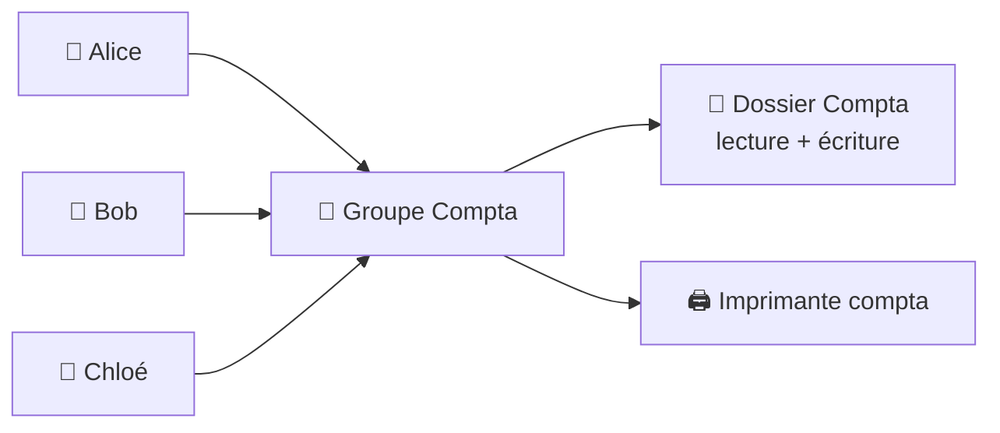

# Administration 02 — Comptes, groupes & droits

🕐 Lecture : ~6 min · Niveau : débutant · ⭐ Fondamental

---

## 🔑 L'analogie du quotidien

Imagine un **immeuble de bureaux avec des badges** :

- Chaque personne a **son badge** (son **compte**).
- On ne règle pas les accès personne par personne : on crée des **groupes** (« Compta »,
  « Direction », « Accueil ») et on ouvre les portes **par groupe**.
- Chaque porte a une **règle** : qui peut l'ouvrir, et pour **lire** ou pour **modifier**
  (les **droits**).

Administrer les accès, c'est gérer ces trois choses : **comptes**, **groupes**, **droits**.

---

## 👤 Comptes : un par personne, jamais partagé

- **Un compte nominatif par utilisateur.** Jamais de compte « commun » partagé à
  plusieurs : impossible de savoir qui a fait quoi (traçabilité) et de couper l'accès
  d'une seule personne.
- Les **comptes de service** (pour un logiciel) sont séparés des comptes humains.
- Les **comptes admin** sont réservés et surveillés (cf. module 01).

---

## 👥 Groupes : la clé pour ne pas devenir fou

Le secret d'une administration propre : **on donne les droits aux GROUPES, pas aux
personnes**.

> 💡 Avantage énorme : un nouvel arrivant en compta ? Tu l'ajoutes au **groupe Compta**
> et il hérite **de tous les bons accès d'un coup**. Un départ ? Tu le retires. Plus
> besoin de toucher à chaque dossier. C'est la base d'un parc gérable.

---

## 🔐 Droits : lecture, écriture… le moindre privilège

Pour chaque ressource (dossier, imprimante…), on définit **qui** et **quoi** :

- **Lecture seule** : peut consulter, pas modifier.
- **Lecture + écriture (modification)** : peut créer/modifier/supprimer.
- **Contrôle total** : tout, y compris changer les droits (à réserver aux admins).

**Principe du moindre privilège** (rappel cours 09) : **chacun reçoit le strict
nécessaire**, rien de plus. La compta n'accède pas aux dossiers RH, et inversement.

> ⚠️ L'erreur classique du débutant : donner « Contrôle total à Tout le monde » parce que
> « ça marche ». Ça marche… et c'est une catastrophe de sécurité. Prends 2 minutes de
> plus pour faire propre.

---

## 🖥️ Comptes locaux vs comptes du domaine

- **Compte local** : existe sur **une seule machine** (TPE, groupe de travail).
- **Compte de domaine** : géré par **Active Directory**, fonctionne sur **tous** les
  postes de l'entreprise (PME — cf. cours 13 et module 04).

En PME, on administre **les comptes du domaine** : création, groupes, droits, tout est
centralisé.

---

## ✅ Ce qu'il faut retenir

1. **Un compte nominatif par personne** (jamais de compte partagé).
2. On donne les droits **aux groupes**, pas aux individus → parc gérable (arrivées/départs
   en un clic).
3. **Moindre privilège** : lecture seule par défaut, écriture si nécessaire, contrôle
   total réservé aux admins.

## 🔧 À essayer

Sur Windows, ouvre PowerShell et tape `Get-LocalGroup` : tu vois les groupes locaux (dont
« Administrateurs », « Utilisateurs »). Puis `Get-LocalGroupMember Administrateurs` :
**qui a les pleins pouvoirs sur cette machine** ? Vérifie qu'il n'y a pas de surprise.
*(Linux : `getent group sudo` montre qui peut administrer.)*

---

⬅️ [Administration 01](01-c-est-quoi-administrer.md) · ➡️ [Administration 03 — Windows Server](03-windows-server-decouverte.md)
