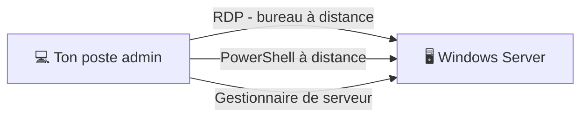

# Administration 03 — Windows Server, découverte

🕐 Lecture : ~6 min · Niveau : intermédiaire

---

## 🏗️ L'analogie du quotidien

**Windows Server**, c'est comme le **Windows que tu connais… mais musclé pour le travail
en équipe**. Là où Windows « normal » est fait pour **une** personne sur **une** machine,
Windows Server est fait pour **servir tout un bureau** : gérer les comptes, partager des
fichiers à grande échelle, héberger des applications, 24h/24.

> 💡 Même logique d'écran (bureau, menu Démarrer), mais on y **ajoute des « rôles »**
> selon ce qu'on veut qu'il fasse.

---

## 🧩 La notion clé : les « rôles »

Un serveur « nu » ne fait rien de spécial. On lui **ajoute des rôles** = les métiers qu'on
veut lui confier (rappel cours 15) :

| Rôle | Ce qu'il fait |
|---|---|
| **AD DS** (Active Directory) | Gérer les comptes et le domaine |
| **DNS** | L'annuaire interne (noms → IP) |
| **DHCP** | Distribuer les adresses IP |
| **Services de fichiers** | Partages et droits NTFS |
| **Hyper-V** | Virtualisation (faire tourner des VM) |
| **Serveur d'impression** | Centraliser les imprimantes |

On ajoute/retire les rôles via le **Gestionnaire de serveur** (interface principale).

---

## 🖥️ Avec ou sans interface graphique

- **Desktop Experience** : avec le bureau graphique (plus simple pour débuter). ✅
- **Server Core** : **sans** interface graphique, tout en ligne de commande / à distance.
  Plus léger et plus sûr (moins de surface d'attaque), mais plus technique.

> 💡 Pour apprendre : commence en **Desktop Experience**. Tu passeras à Core plus tard si
> besoin.

---

## 🔢 Les versions (pour s'y retrouver)

Windows Server sort par millésimes : **2016, 2019, 2022, 2025…**. En administration tu
dois savoir **quelle version** tourne chez le client et **jusqu'à quand elle est
supportée** (après, plus de mises à jour de sécurité = danger → il faut migrer).

> ⚠️ Un serveur sur une version **en fin de support** est un **risque majeur** à signaler
> dans ton audit (comme un Windows poste obsolète).

---

## 🔌 Comment on l'administre

- **Sur place** : directement sur l'écran du serveur.
- **À distance** : **RDP** (Bureau à distance) pour voir son écran, ou **PowerShell** pour
  les commandes. En pratique, on administre **presque toujours à distance**.

---

## ✅ Ce qu'il faut retenir

1. **Windows Server = Windows renforcé pour servir toute une entreprise** (comptes,
   fichiers, applis, 24h/24).
2. On lui confie des **rôles** (AD, DNS, DHCP, fichiers, Hyper-V…) via le **Gestionnaire
   de serveur**.
3. On l'administre surtout **à distance** (RDP / PowerShell) ; surveille toujours la
   **version** et sa **fin de support**.

## 🔧 À essayer

Pas besoin d'un vrai serveur : au **TP02**, tu installeras Windows Server **gratuitement**
dans une machine virtuelle (version d'évaluation 180 jours). Pour l'instant, regarde une
courte vidéo « Windows Server — Server Manager overview » et repère le bouton **« Add
Roles and Features »** (ajouter des rôles).

> ➡️ Puis passe au [TP01 — Monter ton labo virtuel](tp/tp01-labo-virtuel.md).

---

⬅️ [Administration 02](02-comptes-groupes-droits.md) · ➡️ [Administration 04 — Active Directory en pratique](04-active-directory-pratique.md)
