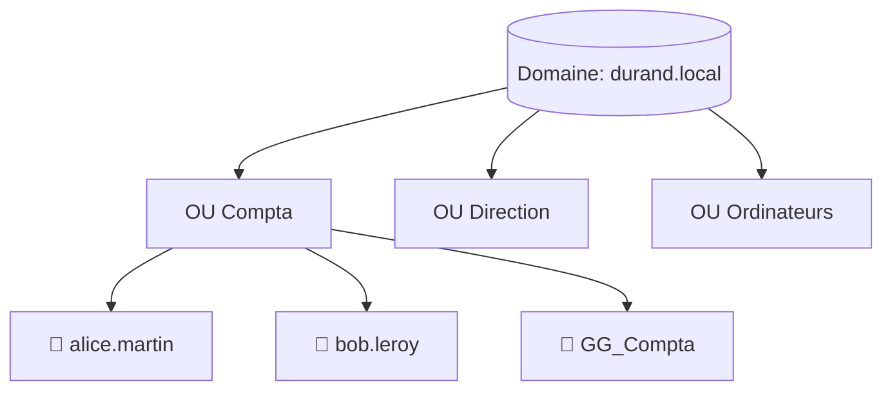

# Administration 04 — Active Directory en pratique

🕐 Lecture : ~7 min · Niveau : intermédiaire

> Rappel : Active Directory = la **réception centrale** des comptes (cours 13). Ici, on
> passe à la **pratique** : créer et organiser.

---

## 🗂️ L'analogie du quotidien

Administrer l'AD, c'est **ranger un grand classeur d'entreprise** :

- Les **utilisateurs** = les fiches de chaque employé.
- Les **groupes** = les intercalaires par métier (Compta, Direction…).
- Les **unités d'organisation (OU)** = les **grands tiroirs** qui rangent le tout par
  service ou par site.

Un AD bien rangé = une administration facile. Un AD en vrac = un cauchemar.

---

## 🧱 Les 3 objets de base

### 1. L'utilisateur
La fiche d'un employé : identifiant de connexion, nom, mot de passe, appartenance à des
groupes. C'est ce compte qui lui permet de se connecter **sur n'importe quel poste** du
domaine.

### 2. Le groupe
Un regroupement d'utilisateurs pour **attribuer des droits en masse** (rappel module 02).
Ex : le groupe `GG_Compta` donne accès au dossier compta et à l'imprimante compta.

### 3. L'unité d'organisation (OU)
Un **conteneur** pour organiser utilisateurs et ordinateurs (par service, par site). Son
intérêt : on peut **appliquer des règles (GPO) à une OU entière** (module 05).

---

## 🏷️ Les bonnes habitudes de nommage

Un parc pro suit des **conventions** cohérentes :

- Utilisateurs : `prenom.nom` (ex : `alice.martin`).
- Groupes : un préfixe clair (ex : `GG_Compta`, `GG_Direction`).
- Ordinateurs : `PC-SERVICE-NN` (ex : `PC-COMPTA-01`).

> 💡 Des noms cohérents, c'est 80 % d'une administration lisible. Tu te remercieras plus
> tard (et tes collègues aussi).

---

## 🔄 Le quotidien de l'admin AD

- **Arrivée** d'un salarié → créer le compte, l'ajouter aux bons groupes.
- **Changement** de poste → ajuster ses groupes.
- **Départ** → **désactiver** le compte (plutôt que supprimer tout de suite) puis le
  retirer après transfert des données. Révoquer **le jour même** (rappel exploitation 06).
- **Mot de passe oublié** → le réinitialiser (la demande la plus fréquente !).

> 💡 **Désactiver** plutôt que supprimer : ça coupe l'accès immédiatement **sans perdre**
> les données/droits associés, le temps de récupérer les fichiers du partant.

---

## 🛠️ Avec quoi on fait ça

- **Utilisateurs et ordinateurs Active Directory** (console graphique « ADUC »).
- Ou en **PowerShell** : `New-ADUser`, `Add-ADGroupMember`, `Disable-ADAccount`… (plus
  rapide, et scriptable pour créer 20 comptes d'un coup).

---

## ✅ Ce qu'il faut retenir

1. Les 3 objets de base : **utilisateur** (fiche), **groupe** (droits en masse), **OU**
   (tiroir de rangement + cible des GPO).
2. Adopte des **conventions de nommage** cohérentes dès le départ.
3. Au départ d'un salarié : **désactiver le compte le jour même**, supprimer après
   transfert.

## 🔧 À essayer

Tu pratiqueras pour de vrai au [TP03](tp/tp03-ad-utilisateurs-gpo.md). En attendant,
écris sur papier le **plan AD** du Cabinet Durand (cas pratique) : quelles **OU**, quels
**groupes**, et place 2-3 utilisateurs. Tu verras, « penser le rangement » est la vraie
compétence.

---

⬅️ [Administration 03](03-windows-server-decouverte.md) · ➡️ [Administration 05 — Les GPO en pratique](05-gpo-pratique.md)
