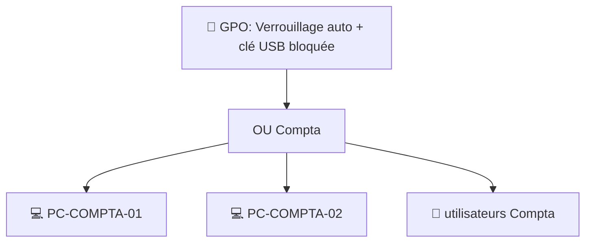

# Administration 05 — Les GPO en pratique

🕐 Lecture : ~6 min · Niveau : intermédiaire

---

## 📢 L'analogie du quotidien

Une **GPO** (*Group Policy Object* = « stratégie de groupe »), c'est le **règlement
intérieur affiché automatiquement dans chaque bureau**. Au lieu de passer dans chaque
bureau pour coller la règle au mur, tu l'écris **une fois** à la réception, et elle
s'applique **toute seule** à tout le monde.

> 💡 C'est le super-pouvoir de l'admin AD : **configurer tout le parc sans toucher chaque
> poste**.

---

## 🎯 Ce qu'on fait avec des GPO

Quelques exemples très courants en entreprise :

- **Sécurité** : imposer un mot de passe complexe, verrouiller la session après X minutes
  d'inactivité, bloquer les clés USB.
- **Confort** : connecter automatiquement un **lecteur réseau** (`S:` = partage compta),
  installer l'**imprimante** du service, fixer le fond d'écran.
- **Contrôle** : interdire l'installation de logiciels, limiter l'accès au Panneau de
  configuration.
- **Déploiement** : pousser un logiciel ou une mise à jour sur un groupe de machines.

---

## 🧭 Comment une GPO s'applique

Une GPO est **liée** à un conteneur (le domaine entier, ou une **OU** précise). Elle
s'applique à tout ce qui est **dans** ce conteneur.

> 💡 C'est pour ça que les **OU** (module 04) sont importantes : elles permettent
> d'appliquer des règles **différentes** selon le service (ex : clé USB autorisée en
> direction, bloquée en compta).

---

## 🧩 Deux moitiés dans une GPO

- **Configuration ordinateur** : s'applique à la **machine** (ex : réglages de sécurité,
  au démarrage).
- **Configuration utilisateur** : s'applique à la **personne** (ex : lecteur réseau, à la
  connexion).

Tu choisis la bonne moitié selon ce que tu veux régler.

---

## 🛠️ Les outils

- **Gestion des stratégies de groupe** (console « GPMC ») : créer, lier, ordonner les GPO.
- `gpupdate /force` (sur un poste) : **forcer** l'application immédiate sans attendre.
- `gpresult /r` : voir **quelles GPO s'appliquent** à un poste/utilisateur (indispensable
  pour dépanner « pourquoi cette règle ne passe pas ? »).

> ⚠️ Règle de prudence : **teste une GPO sur une OU de test** (1-2 machines) **avant** de
> la lier à tout le domaine. Une GPO mal réglée peut bloquer tout le monde d'un coup.

---

## ✅ Ce qu'il faut retenir

1. Une **GPO = un règlement appliqué automatiquement** à tout un périmètre (domaine ou
   OU), sans toucher chaque poste.
2. Elle a deux moitiés : **ordinateur** et **utilisateur** ; elle se **lie** à une OU pour
   cibler un service.
3. **Teste sur une OU de test d'abord** ; outils clés : GPMC, `gpupdate /force`,
   `gpresult /r`.

## 🔧 À essayer

Au [TP03](tp/tp03-ad-utilisateurs-gpo.md), tu créeras une vraie GPO (verrouillage auto de
session). En attendant : sur ton PC Windows pro, ouvre `cmd` et tape `gpresult /r`. Si ton
poste est dans un domaine, tu verras la liste des GPO qui s'appliquent à toi. Sinon, tu
verras qu'il n'y en a pas (poste autonome).

---

⬅️ [Administration 04](04-active-directory-pratique.md) · ➡️ [Administration 06 — Droits NTFS & partages](06-droits-ntfs-partages.md)
