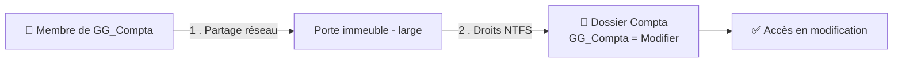

# Administration 06 — Droits NTFS & partages

🕐 Lecture : ~7 min · Niveau : intermédiaire · ⭐ Le cœur du serveur de fichiers

---

## 🚪 L'analogie du quotidien

Pour accéder à un dossier sur le serveur depuis le réseau, il faut franchir **deux
portes** :

1. La **porte d'entrée de l'immeuble** = le **partage réseau** (as-tu le droit d'entrer
   dans le bâtiment ?).
2. La **porte du bureau** à l'intérieur = les **droits NTFS** (une fois dedans, dans quelle
   pièce peux-tu entrer, et peux-tu toucher aux dossiers ?).

Pour arriver au fichier, il faut passer **les deux portes**. C'est **le** point qui
déroute les débutants — alors allons-y doucement.

---

## 🧩 Partage réseau vs droits NTFS

| | **Permissions de partage** | **Permissions NTFS** |
|---|---|---|
| Portée | l'accès **par le réseau** | l'accès au **dossier/fichier lui-même** |
| S'applique | quand on vient **du réseau** | **toujours** (réseau **et** local) |
| Analogie | la porte de l'immeuble | la porte de chaque bureau |

> 💡 **Règle quand les deux se combinent : c'est le plus restrictif qui gagne.** Si le
> partage dit « Lecture » mais NTFS dit « Modifier », l'utilisateur n'aura que
> **Lecture**. La porte la plus fermée l'emporte.

---

## 🧭 La méthode qui marche (recommandée)

Pour ne pas s'emmêler, la bonne pratique des admins :

1. **Partage** : donner un accès large (ex : « Utilisateurs authentifiés = Modifier » ou
   « Contrôle total »).
2. **NTFS** : faire **tout le réglage fin ici**, via des **groupes** (module 02/04).

Ainsi, tu gères les vrais droits **à un seul endroit** (NTFS), c'est clair et maintenable.

---

## 🔐 Les droits NTFS courants

- **Lecture** : voir et ouvrir.
- **Modifier** : lire + créer/modifier/supprimer. *(le droit « normal » d'un utilisateur)*
- **Contrôle total** : tout, **y compris changer les droits** → réservé aux admins.

Et le **moindre privilège** s'applique toujours : par défaut lecture, écriture si
nécessaire.

---

## ⚠️ L'héritage : le piège classique

Les droits se **transmettent du dossier parent vers les sous-dossiers** (l'**héritage**).
C'est pratique… mais source d'erreurs :

- Un droit mis trop haut **descend partout** sans qu'on le veuille.
- Parfois on doit **couper l'héritage** sur un sous-dossier sensible (ex : un dossier
  « Paie » dans « Compta » accessible seulement à la direction).

> 💡 Réflexe de dépannage « pourquoi X accède à ce dossier ?! » : regarde les droits
> **hérités** du parent, pas seulement ceux du dossier lui-même.

---

## ✅ Ce qu'il faut retenir

1. Deux portes à franchir : **partage réseau** (l'immeuble) + **droits NTFS** (le bureau) ;
   quand elles se combinent, **le plus restrictif gagne**.
2. Bonne méthode : **partage large**, **réglage fin en NTFS via des groupes**.
3. Attention à l'**héritage** (les droits descendent du parent) : à couper sur les dossiers
   sensibles.

## 🔧 À essayer

Tu pratiqueras au [TP04](tp/tp04-serveur-fichiers-ntfs.md). En attendant, sur ton PC :
clic droit sur un dossier → **Propriétés** → onglet **Sécurité**. Tu vois la liste des
droits **NTFS** (groupes/utilisateurs + cases Lecture/Modifier…). Clique sur
**Avancé** pour voir l'**héritage**. Ne change rien, observe.

---

⬅️ [Administration 05](05-gpo-pratique.md) · ➡️ [Administration 07 — Linux serveur](07-linux-serveur-bases.md)
