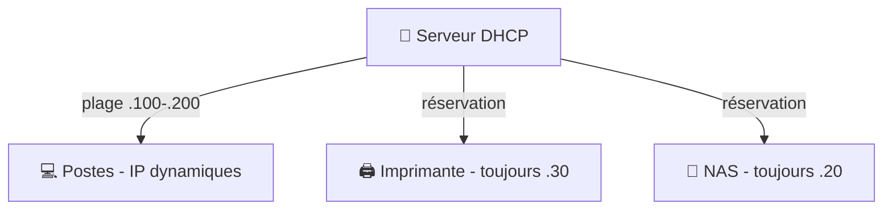

# Administration 08 — DHCP & DNS côté serveur

🕐 Lecture : ~6 min · Niveau : intermédiaire

> Rappel cours 03 : **DHCP = le gardien de parking** (distribue les IP), **DNS =
> l'annuaire** (noms → IP). En TPE, c'est la box qui s'en charge. En PME, **c'est souvent
> le serveur** — et c'est toi qui l'administres.

---

## 🏢 Pourquoi gérer ça sur le serveur (et pas la box)

Quand l'entreprise grandit, laisser la box tout faire montre ses limites. Un serveur
DHCP/DNS apporte :

- Des **réservations** fiables (telle machine a **toujours** la même IP).
- Un **DNS interne** qui connaît les noms de **tes** machines (`srv-durand.durand.local`).
- Une **intégration avec Active Directory** (l'AD a **besoin** d'un DNS bien configuré pour
  fonctionner).
- Plus de **contrôle** et de **visibilité** (qui a quelle IP, historique…).

> 💡 Point important : **Active Directory et DNS sont inséparables.** Installer un
> contrôleur de domaine installe presque toujours le **rôle DNS** avec lui.

---

## 🎫 Administrer le DHCP

Le serveur DHCP distribue les adresses selon une **étendue** (*scope*) que tu définis :

- **Plage distribuée** : ex. `192.168.1.100` → `192.168.1.200`.
- **Options** transmises aux clients : la **passerelle**, le **serveur DNS**, le domaine.
- **Durée du bail** : combien de temps une IP est prêtée.
- **Réservations** : lier une IP fixe à une machine précise (par son adresse MAC) — idéal
  pour imprimantes, serveurs, NAS.

> 💡 **Bonne pratique d'adressage** : réserve le **bas** de la plage (`.1` à `.99`) aux
> équipements fixes (serveurs, imprimantes, NAS) et laisse le DHCP distribuer le **haut**
> (`.100`+) aux postes. Un plan clair = un réseau lisible.

---

## 📇 Administrer le DNS interne

Le DNS du serveur gère les **noms internes** de l'entreprise :

- **Enregistrement A** : un nom → une IP (`srv-durand` → `192.168.1.10`).
- Les postes trouvent le serveur, le NAS, les imprimantes **par leur nom**.
- Pour les sites externes (internet), le DNS interne **fait suivre** (forwarders) vers un
  DNS public (ex : celui de l'opérateur, `1.1.1.1`…).

> ⚠️ Un DNS mal réglé en PME = **AD qui déraille, connexions lentes, partages
> introuvables**. Beaucoup de pannes « bizarres » en domaine sont en réalité des **soucis
> DNS**. Premier réflexe de dépannage en environnement AD : **vérifier le DNS**.

---

## ✅ Ce qu'il faut retenir

1. En PME, **DHCP et DNS passent souvent du côté serveur** (plus de contrôle, et **AD
   l'exige**).
2. DHCP : définir une **étendue** (plage + passerelle + DNS) et des **réservations** pour
   le matériel fixe.
3. DNS interne : résout les **noms des machines locales** et **fait suivre** vers un DNS
   public ; en cas de panne AD, **suspecte le DNS en premier**.

## 🔧 À essayer

Sur ton réseau actuel, lance `ipconfig /all` (Windows) : repère **« Serveur DHCP »** et
**« Serveurs DNS »**. Pointent-ils vers ta box (`192.168.1.1`) ou vers un **serveur
dédié** ? Dans une PME équipée, tu verrais l'IP du serveur. *(Linux : `cat
/etc/resolv.conf` pour le DNS, `ip a` pour l'IP.)*

---

⬅️ [Administration 07](07-linux-serveur-bases.md) · ➡️ [Administration 09 — Journaux & supervision](09-logs-supervision.md)
