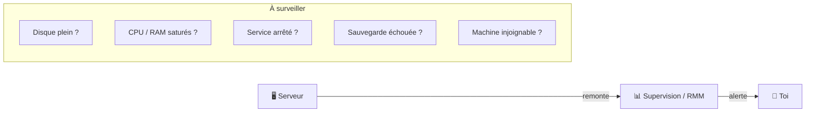

# Administration 09 — Journaux (logs) & supervision

🕐 Lecture : ~6 min · Niveau : intermédiaire

---

## 🎥 L'analogie du quotidien

Les **journaux (logs)**, ce sont les **caméras de surveillance** du serveur : ils
enregistrent **tout ce qui s'est passé**. Quand un incident arrive, au lieu de deviner, tu
**rembobines la vidéo** pour voir ce qui a cloché, et quand.

La **supervision**, elle, c'est le **gardien qui regarde les écrans en direct** et
t'appelle **avant** que ça tourne mal (rappel exploitation 01).

> 💡 Logs = le passé (enquêter). Supervision = le présent/futur (prévenir). Les deux sont
> complémentaires.

---

## 📜 Lire les journaux

### Sous Windows
L'**Observateur d'événements** (*Event Viewer*) classe les logs :

- **Application** : les logiciels.
- **Système** : le système d'exploitation (pilotes, services, démarrage).
- **Sécurité** : les connexions, les échecs d'authentification (précieux côté sécu).

Chaque événement a un **niveau** : Information, **Avertissement** 🟠, **Erreur** 🔴,
Critique.

> 💡 Réflexe de dépannage : un service plante ? Ouvre l'Observateur d'événements, filtre
> sur **Erreur/Critique** autour de l'heure du problème. La cause y est souvent écrite
> noir sur blanc.

### Sous Linux
Les logs vivent dans `/var/log` et via **`journalctl`** :

```bash
journalctl -xe              # les derniers événements, détaillés
journalctl -u ssh           # les logs du service SSH
tail -f /var/log/syslog     # suivre un log en direct
```

---

## 👀 Superviser en continu

Au-delà de lire les logs après coup, on **surveille en temps réel** les indicateurs clés :



En PME/infogérance, ces indicateurs remontent dans ton **RMM** (exploitation 01), qui
t'**alerte automatiquement**. Pour du Linux pur, des outils comme **Zabbix**, **Grafana**
ou le monitoring intégré du NAS font le même travail.

---

## 🎯 Quoi surveiller en priorité sur un serveur

- **Espace disque** (la panne n°1 — cf. cas pratique, fiche #091).
- **Services critiques** actifs (base de données, AD, partage…).
- **Sauvegardes** réussies.
- **Charge** (CPU/RAM) anormale.
- **Échecs de connexion** répétés (signe d'attaque).

---

## ✅ Ce qu'il faut retenir

1. **Logs = caméras** (enquêter sur le passé) ; **supervision = gardien en direct**
   (prévenir).
2. Windows : **Observateur d'événements** (Application/Système/Sécurité) ; Linux :
   **`journalctl`** et `/var/log`.
3. Sur un serveur, surveille en priorité : **disque, services, sauvegardes, charge, échecs
   de connexion**.

## 🔧 À essayer

Sur ton PC Windows, ouvre l'**Observateur d'événements** (tape « observateur » dans le menu
Démarrer) → **Journaux Windows → Système**. Filtre sur **Erreur**. Tu vois l'historique des
soucis de ta machine. *(Linux/WSL : `journalctl -p err -xe` pour les erreurs.)*

---

⬅️ [Administration 08](08-dhcp-dns-serveur.md) · ➡️ [Administration 10 — MAJ, sauvegarde & sécurisation](10-maj-sauvegarde-securite.md)
