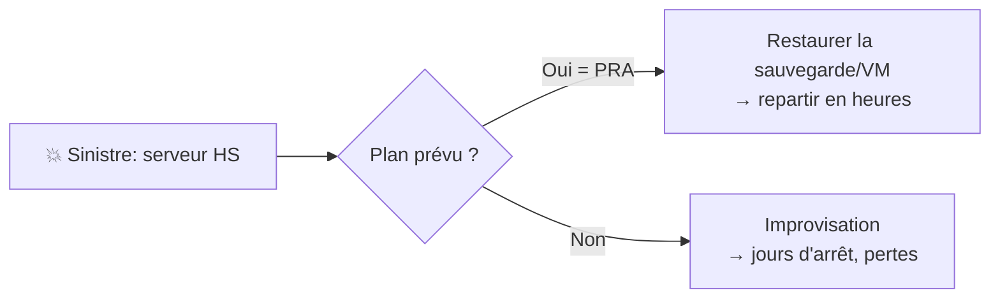

# Administration 10 — MAJ, sauvegarde & sécurisation serveur

🕐 Lecture : ~7 min · Niveau : intermédiaire · ⭐ Garder un serveur sain

> Le serveur est **la pièce la plus critique** : s'il tombe, **toute l'entreprise
> s'arrête**. Trois piliers pour le garder sain : **mettre à jour**, **sauvegarder**,
> **sécuriser**.

---

## 🩺 L'analogie du quotidien

Un serveur, c'est comme le **cœur d'un bâtiment** (chaufferie, tableau électrique) : on ne
le bricole pas n'importe comment. On fait des **révisions planifiées** (MAJ), on a un
**plan B** si ça lâche (sauvegarde/PRA), et on **ferme bien la porte** de la salle
technique (sécurité).

---

## 🔄 1. Les mises à jour (patch management)

- **Pourquoi** : corriger les **failles de sécurité** et les bugs (rappel cours 09).
- **Le dilemme du serveur** : une MAJ peut nécessiter un **redémarrage** → on la planifie
  **hors heures ouvrées** (le soir, le week-end).
- **La règle d'or** : **tester avant**. Une MAJ qui casse le logiciel métier en pleine
  journée = catastrophe. Idéalement, tester sur une VM de test, ou attendre quelques jours
  après la sortie d'une grosse mise à jour.
- **Outils** : WSUS / le RMM côté Windows ; `apt`/`dnf` + unattended-upgrades côté Linux.

> 💡 En infogérance, le **patch management** est une prestation : mises à jour planifiées,
> contrôlées, et **reportées** au client.

---

## 💾 2. La sauvegarde du serveur (et le PRA)

Le serveur mérite une sauvegarde **à sa hauteur** (rappel cours 08, règle 3-2-1) :

- Sauvegarder **les données ET le système** (idéalement une **image complète**, pour
  restaurer vite).
- Si le serveur est **virtualisé** (cours 15), on sauvegarde la **VM entière** → on peut la
  **remonter sur un autre hôte** en cas de panne matérielle. Énorme avantage.
- **Tester la restauration** régulièrement (une sauvegarde non testée n'existe pas).

### Le PRA / PCA

- **PRA** (Plan de Reprise d'Activité) : **comment on repart** après un sinistre, et **en
  combien de temps**.
- **PCA** (Plan de Continuité) : comment on **continue sans interruption** (plus poussé).
- Deux chiffres à connaître : **RPO** (combien de données on accepte de perdre — ex : 24 h)
  et **RTO** (en combien de temps on redémarre — ex : 4 h). Ils guident le choix des
  sauvegardes.

> 💡 À vendre comme un service : un client qui sait **en combien de temps** il repart après
> un désastre dort mieux. C'est concret et rassurant.

---

## 🔒 3. Sécuriser le serveur (durcissement)

Le **durcissement** (*hardening*) = **réduire la surface d'attaque** :

- **Comptes** : renommer/désactiver les comptes par défaut, 2FA sur les accès admin,
  moindre privilège. Côté Linux : **pas de connexion root directe**, **clés SSH** plutôt
  que mot de passe.
- **Services** : **désactiver ce qui ne sert pas** (chaque service ouvert = une porte).
- **Pare-feu** : n'ouvrir **que** les ports nécessaires (ex : RDP/SSH restreints à ton IP
  d'admin).
- **Accès distant** : jamais exposer RDP/SSH « nus » sur internet → passer par un **VPN**
  (cours 10).
- **Mises à jour** : à jour = la base de la sécurité.
- **Sauvegardes protégées** : contre les rançongiciels (copies **hors ligne** /
  immuables).

> ⚠️ Les serveurs exposés avec **RDP ouvert sur internet** sont une **cause n°1** de
> rançongiciels en PME. À ne **jamais** faire.

---

## ✅ Ce qu'il faut retenir

1. **Mises à jour** : planifiées hors heures ouvrées, **testées avant**, reportées au
   client.
2. **Sauvegarde** du serveur (données **+** système / VM entière), **3-2-1**, **testée** ;
   définir un **PRA** avec **RPO/RTO**.
3. **Durcir** : moindre privilège, désactiver l'inutile, pare-feu serré, **jamais de
   RDP/SSH exposé** (→ VPN), sauvegardes anti-rançongiciel.

## 🔧 À essayer

Réfléchis au Cabinet Durand (cas pratique) : s'il **perdait son serveur demain matin**,
quel est son **RPO** (dernière sauvegarde = combien de données perdues ?) et son **RTO**
(combien de temps pour repartir ?) avec la solution 3-2-1 mise en place ? Écris les deux
chiffres : tu viens d'esquisser son PRA.

---

⬅️ [Administration 09](09-logs-supervision.md) · 🏁 [Section administration](README.md) · 🧪 [Les TP](tp/)
