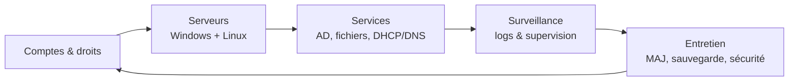

# 🧑‍💼 Administration réseau & serveur

Jusqu'ici tu as appris à **comprendre** et **concevoir** un réseau. Ici tu apprends à
l'**administrer** : gérer les comptes, les droits, les serveurs, les services — **le
travail quotidien** d'un infogéreur sur le parc d'un client.

> 🎯 Objectif : savoir **installer, configurer et tenir** un serveur et ses services,
> sous **Windows Server** comme sous **Linux**, et gérer proprement **qui a accès à
> quoi**.

---

## 🧭 De quoi on parle

**Administrer**, c'est être le **gestionnaire de l'immeuble** : tu ne construis pas les
murs (ça, c'est l'installation), tu **gères la vie dedans** — les clés, les droits
d'accès, l'entretien, les services communs, la sécurité.

---

## 📚 Les modules

| # | Module | Ce que tu apprends |
|---|---|---|
| 01 | [C'est quoi administrer](01-c-est-quoi-administrer.md) | L'état d'esprit et les outils |
| 02 | [Comptes, groupes & droits](02-comptes-groupes-droits.md) | Le moindre privilège en pratique |
| 03 | [Windows Server — découverte](03-windows-server-decouverte.md) | Installer et les rôles |
| 04 | [Active Directory en pratique](04-active-directory-pratique.md) | Utilisateurs, groupes, OU |
| 05 | [Les GPO en pratique](05-gpo-pratique.md) | Appliquer des règles au parc |
| 06 | [Droits NTFS & partages](06-droits-ntfs-partages.md) | Qui accède à quel dossier |
| 07 | [Linux serveur — les bases](07-linux-serveur-bases.md) | Shell, users, droits, services, SSH |
| 08 | [DHCP & DNS côté serveur](08-dhcp-dns-serveur.md) | Gérer ces services soi-même |
| 09 | [Journaux (logs) & supervision](09-logs-supervision.md) | Savoir ce qui se passe |
| 10 | [MAJ, sauvegarde & sécurisation serveur](10-maj-sauvegarde-securite.md) | Garder un serveur sain |

---

## 🧪 Les TP (dans des machines virtuelles gratuites)

Pour t'entraîner **sans serveur réel** : on monte un **labo virtuel** sur ton PC. Tout
est gratuit. Dossier [`tp/`](tp/).

| TP | Titre |
|---|---|
| [TP01](tp/tp01-labo-virtuel.md) | Monter ton labo virtuel (VirtualBox) |
| [TP02](tp/tp02-installer-windows-server.md) | Installer Windows Server + contrôleur de domaine |
| [TP03](tp/tp03-ad-utilisateurs-gpo.md) | Créer utilisateurs, groupes, OU et une GPO |
| [TP04](tp/tp04-serveur-fichiers-ntfs.md) | Serveur de fichiers & droits NTFS |
| [TP05](tp/tp05-ubuntu-server-ssh.md) | Un serveur Linux : SSH, utilisateurs, services |
| [TP06](tp/tp06-scenario-admin.md) | Scénario d'administration complet |

---

## 🗂️ Fiche-mémo associée

- [Commandes d'administration](../fiches-memo/fiche-commandes-admin.md) — PowerShell
  (Windows) & terminal (Linux), côte à côte.

---

> 💡 Prérequis conseillés : avoir vu les cours 13 (Active Directory), 15 (serveur) et la
> section [exploitation](../exploitation/). Pas obligatoire, mais ça aide.

---

🎉 **C'est la dernière phase du [Parcours](../PARCOURS.md).** À la fin des TP, tu auras
fait le tour complet de la formation.

⬅️ [Retour au sommaire](../README.md) · 🧭 [Parcours](../PARCOURS.md)
