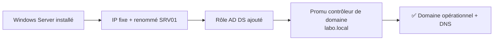

# TP02 — Installer Windows Server + contrôleur de domaine

🎯 **Objectif** : installer Windows Server dans une VM et le **promouvoir contrôleur de
domaine** (créer ton propre domaine AD). 🕐 Durée : ~60 min · Prérequis : TP01, admin 03/04.

> 🏆 C'est un gros TP, le plus formateur. Fais-le en 2 fois si besoin (snapshot entre les
> deux !).

---

## 1. Récupérer Windows Server (gratuit pour tester)

Microsoft propose une **version d'évaluation gratuite (180 jours)** de Windows Server :
cherche **« Windows Server evaluation ISO »** sur le site de Microsoft (Evaluation Center)
et télécharge l'**ISO**.

## 2. Créer la VM

- Dans VirtualBox : **Nouvelle** → nom `SRV01`.
- Type : Microsoft Windows, Version : Windows Server (64-bit).
- RAM : **4096 Mo** (4 Go) · Disque : **40 Go**.
- Réseau (comme vu au [TP01](tp01-labo-virtuel.md#5-le-réseau-du-labo--à-lire-attentivement-)) : **2 cartes** →
  **Carte 1 = NAT** (internet) et **Carte 2 = Réseau interne nommé `LAB`** (le réseau du labo).
- Branche l'ISO (Stockage) et **démarre**.

## 3. Installer le système

1. Choisis la langue → **Installer maintenant**.
2. **Important** : choisis l'édition **« Desktop Experience »** (avec interface graphique),
   pas « Core ».
3. Type : **Personnalisé** → installe sur le disque de 40 Go.
4. Patiente, la VM redémarre, puis **définis le mot de passe Administrateur** (fort !).

> 🔑 Astuce VirtualBox : pour envoyer Ctrl+Alt+Suppr à la VM, menu **Entrée → Insérer
> Ctrl-Alt-Suppr**.

## 4. Réglages de base du serveur

Dans le **Gestionnaire de serveur** (s'ouvre tout seul) :

1. **Renomme** le serveur en `SRV01` (Serveur local → Nom de l'ordinateur) → redémarre.
2. Donne-lui une **IP fixe sur la carte `LAB`** — un serveur ne doit pas changer d'adresse.
   Repère la carte reliée au réseau interne (celle **sans** internet), puis :
   - Adresse IP : **`10.10.10.10`** · Masque : `255.255.255.0`
   - Passerelle : **laisse vide** (internet passe par la carte NAT)
   - DNS préféré : **`127.0.0.1`** (lui-même — il deviendra serveur DNS à l'étape 6)
   > 💡 L'autre carte (NAT) reste en **automatique (DHCP)** : c'est elle qui fournit internet.

## 5. Ajouter le rôle Active Directory

1. Gestionnaire de serveur → **Gérer → Ajouter des rôles et fonctionnalités**.
2. Coche **« Services AD DS » (Active Directory Domain Services)** → Suivant → Installer.

## 6. Promouvoir en contrôleur de domaine ⭐

1. Après l'install, clique sur la **bannière d'avertissement** (drapeau en haut) →
   **« Promouvoir ce serveur en contrôleur de domaine »**.
2. **Ajouter une nouvelle forêt** → nom de domaine racine : **`labo.local`**.
3. Définis un **mot de passe DSRM** (mode restauration) et note-le.
4. Laisse les options par défaut (le rôle **DNS** s'ajoute automatiquement — cf. admin 08).
5. **Installer** → le serveur **redémarre**.

## 7. Vérifier

Après redémarrage, connecte-toi en `LABO\Administrateur`. Ouvre le Gestionnaire de serveur :
tu vois maintenant **AD DS** et **DNS**. Ouvre **Outils → Utilisateurs et ordinateurs Active
Directory** : ton domaine `labo.local` est là. 🎉

---

## ✅ Réussite

Tu as **ton propre domaine Active Directory** qui tourne. C'est l'équivalent de ce qu'on
installe au cœur d'une PME.

## 🧠 Snapshot !

Fais un **instantané** nommé « Domaine prêt ». Tu repartiras de là aux TP suivants sans tout
réinstaller.

---

⬅️ [TP01](tp01-labo-virtuel.md) · ➡️ [TP03 — AD : utilisateurs, groupes, GPO](tp03-ad-utilisateurs-gpo.md)
