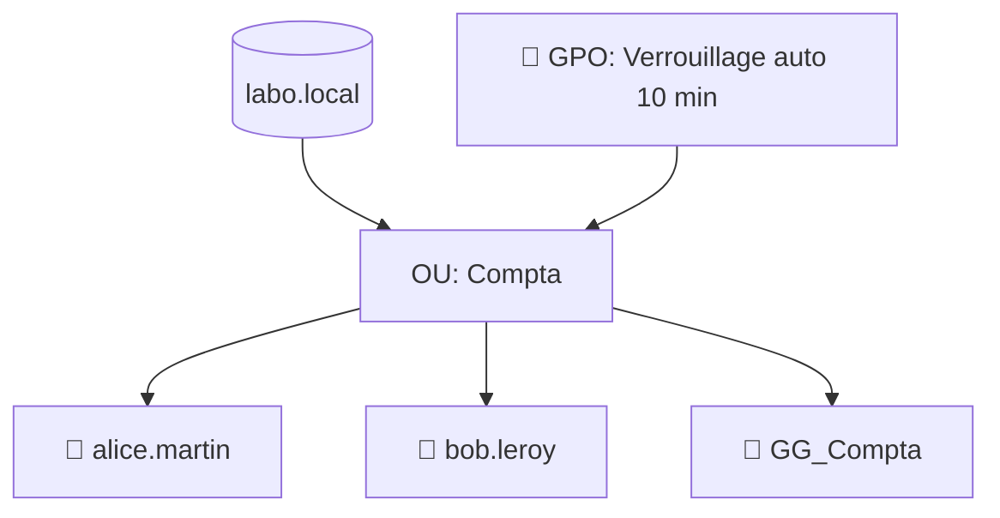

# TP03 — AD : utilisateurs, groupes, OU et une GPO

🎯 **Objectif** : créer une structure AD propre (OU, groupes, utilisateurs) et appliquer
une **GPO**. 🕐 Durée : ~40 min · Prérequis : TP02, admin 04/05.

> On utilise le domaine `labo.local` du TP02. (Repars de ton snapshot « Domaine prêt ».)

---

## 🧱 Ce que tu vas construire

---

## 1. Créer une Unité d'Organisation (OU)

> 📍 **Où ?** Sur le **serveur `SRV01`** (dans la fenêtre de ta VM) : **Gestionnaire de
> serveur → menu Outils → « Utilisateurs et ordinateurs Active Directory »** (ou touche
> Windows, tape `dsa.msc`, Entrée).

1. Ouvre **Utilisateurs et ordinateurs Active Directory** (ADUC).
2. Clic droit sur `labo.local` → **Nouveau → Unité d'organisation** → nomme-la **`Compta`**.

## 2. Créer des utilisateurs

Dans l'OU `Compta` : clic droit → **Nouveau → Utilisateur**.
- Crée **`alice.martin`** (nom d'ouverture de session : `alice.martin`).
- Mot de passe conforme ; décoche « doit changer à la 1ʳᵉ connexion » pour le labo.
- Recommence pour **`bob.leroy`**.

> 💡 En PowerShell, le même résultat : `New-ADUser -Name "alice.martin" -Path "OU=Compta,DC=labo,DC=local" -Enabled $true -AccountPassword (Read-Host -AsSecureString)`

## 3. Créer un groupe et y ajouter les utilisateurs

1. Dans `Compta` : clic droit → **Nouveau → Groupe** → nom **`GG_Compta`** (sécurité,
   globale).
2. Double-clic sur `GG_Compta` → onglet **Membres** → **Ajouter** → `alice.martin`,
   `bob.leroy`.

> 💡 Rappel admin 02 : on donnera ensuite les droits **au groupe** `GG_Compta`, pas aux
> personnes (TP04).

## 4. Créer et lier une GPO

1. Ouvre **Gestion des stratégies de groupe** (GPMC) via Outils.
2. Clic droit sur l'OU **`Compta`** → **Créer un objet GPO dans ce domaine et le lier
   ici** → nomme-la **`GPO-Compta-Securite`**.
3. Clic droit sur la GPO → **Modifier**.
4. Va dans : **Configuration ordinateur → Stratégies → Paramètres Windows → Paramètres de
   sécurité → Stratégies locales → Options de sécurité**.
5. Active **« Ouverture de session interactive : limite d'inactivité de la machine »** →
   **600 secondes** (verrouillage auto après 10 min).

## 5. Tester l'application

- Sur le serveur (ou une VM poste jointe au domaine), ouvre `cmd` → `gpupdate /force`.
- Puis `gpresult /r` : **`GPO-Compta-Securite`** doit apparaître dans les GPO appliquées.

---

## ✅ Réussite

Tu as une OU rangée, des utilisateurs, un groupe, et une **règle de sécurité appliquée
automatiquement**. C'est le quotidien de l'admin AD.

## 🧠 Pour aller plus loin

Crée une 2ᵉ OU `Direction` **sans** la restriction de clé USB, et observe comment des OU
différentes permettent des **règles différentes par service** (admin 05).

---

⬅️ [TP02](tp02-installer-windows-server.md) · ➡️ [TP04 — Serveur de fichiers & NTFS](tp04-serveur-fichiers-ntfs.md)
