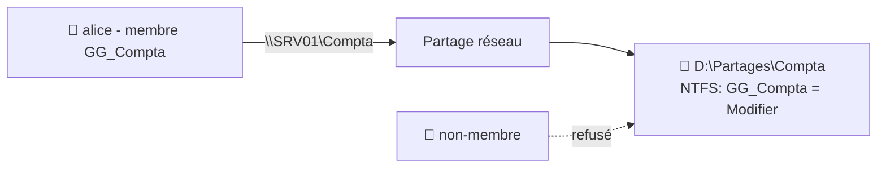

# TP04 — Serveur de fichiers & droits NTFS

🎯 **Objectif** : partager un dossier et régler les **droits NTFS** via un groupe, en
appliquant le moindre privilège. 🕐 Durée : ~35 min · Prérequis : TP03, admin 06.

> On continue sur `SRV01` / `labo.local` avec le groupe `GG_Compta` du TP03.

---

## 🧱 Ce que tu vas construire



---

## 1. Créer le dossier (sur le serveur lui-même)

> 📍 **Où ?** Tu travailles **dans la fenêtre de ta VM Windows Server**, sur le **bureau de
> `SRV01`**. `SRV01` est **le nom du serveur sur lequel tu es déjà** → c'est pour ça que tu
> ne le vois **pas** dans l'explorateur : **on ne se cherche pas soi-même** ! Tu crées donc
> le dossier **localement**, sur le disque du serveur (comme n'importe quel dossier).

1. Sur le bureau de `SRV01`, ouvre l'**Explorateur de fichiers** (icône dossier dans la barre
   des tâches, ou touche **Windows + E**).
2. Clique sur **« Ce PC »**, puis double-clique sur le disque **C:** (ou **D:** si le serveur
   en possède un).
3. Clic droit dans la fenêtre → **Nouveau → Dossier** → nomme-le **`Partages`**.
4. Entre dans `Partages`, crée dedans un dossier **`Compta`**.
   → Tu obtiens `C:\Partages\Compta` (ou `D:\Partages\Compta`). ✅

> 💡 Le `\\SRV01\Compta` qu'on utilisera à l'étape 4 sert à atteindre ce dossier **depuis un
> AUTRE PC, par le réseau** — pas depuis le serveur. (Normal que tu ne « voies pas SRV01 »
> dans l'explorateur du serveur : tu **es** SRV01.)

## 2. Partager le dossier (la porte de l'immeuble)

1. Clic droit sur le dossier `Compta` → **Propriétés** → onglet **Partage** → **Partage
   avancé**.
2. Coche **« Partager ce dossier »** (nom du partage : `Compta`).
3. **Autorisations** (partage) : donne **« Utilisateurs authentifiés » = Contrôle total**.
   *(On fera le réglage fin en NTFS — méthode recommandée, admin 06.)*

## 3. Régler les droits NTFS (la porte du bureau) ⭐

1. Onglet **Sécurité** → **Modifier** → **Ajouter** → tape **`GG_Compta`** → OK.
2. Sélectionne `GG_Compta` → coche **« Modifier »** (lecture + écriture).
3. **Retire les accès trop larges** si présents (ex : le groupe « Utilisateurs » en écriture)
   pour respecter le **moindre privilège**. Garde les Administrateurs en Contrôle total.

## 4. Tester l'accès

> ⚠️ **Ne te connecte PAS en tant qu'`alice.martin` directement sur le serveur !** SRV01 est
> un **contrôleur de domaine** : Windows **interdit par défaut** à un utilisateur standard d'y
> ouvrir une session (message « *La méthode de connexion… n'est pas autorisée* »). C'est
> **normal** — les utilisateurs se connectent sur les **postes**, jamais sur le serveur.

**Option A — la façon propre (réaliste)** : depuis un **poste client** :
1. Crée une petite VM **Windows 10/11** sur le **même réseau LAB**.
2. **Joins-la au domaine** `labo.local` (`sysdm.cpl` → Modifier → Domaine `labo.local`, avec
   un compte admin du domaine).
3. **Ouvre une session `alice.martin` sur ce poste**, tape `\\SRV01\Compta` → crée un fichier. ✅

**Option B — la façon rapide (sans créer de poste)** : depuis le serveur, on s'authentifie
comme alice **sans ouvrir de session**, en ligne de commande :
```
net use \\SRV01\Compta /user:labo\alice.martin
```
→ saisis le mot de passe d'alice, puis ouvre `\\SRV01\Compta` et **essaie de créer un
fichier** (tu agis en tant qu'alice). Pour terminer : `net use \\SRV01\Compta /delete`.

Dans les deux cas, refais le test avec un **compte non membre** de `GG_Compta` → l'accès doit
être **refusé**. ✅

> 💡 Si le résultat te surprend, souviens-toi : **partage + NTFS se combinent, le plus
> restrictif gagne** (admin 06). Et vérifie l'**héritage** (bouton Avancé).

## 5. Bonus : couper l'héritage sur un sous-dossier sensible

1. Crée `D:\Partages\Compta\Paie`.
2. Sécurité → **Avancé** → **Désactiver l'héritage** → *« Convertir… »*.
3. Retire `GG_Compta`, ajoute un groupe `GG_Direction` en **Modifier**.
   → La « Paie » n'est plus visible par toute la compta, seulement par la direction.

---

## 🏢 Et dans une vraie TPE ? (sans Windows Server)

Tu as raison de te poser la question : **une TPE n'a quasiment jamais de Windows Server**
(ça, c'est la PME). Mais **la logique que tu viens d'apprendre — partage + droits + moindre
privilège — est identique partout.** Seul l'écran de réglage change selon le support :

- 🪟 **Depuis un PC Windows 11** : tu peux partager un dossier (clic droit → **Propriétés →
  Partage**, et onglet **Sécurité** pour les droits NTFS) — **exactement la même logique**.
  ⚠️ Limites : le PC doit **rester allumé**, ~**20 connexions simultanées** max, et **pas de
  gestion centralisée**. Dépannage express sur 5-6 postes : OK. Solution durable : non.
- 💾 **Un NAS** (Synology/QNAP, ou TrueNAS/OpenMediaVault) : **LA solution TPE** (cours 07).
  Toujours allumé, droits par dossier, sauvegarde intégrée. Un NAS, c'est justement un **petit
  serveur de fichiers prêt à l'emploi** — mêmes notions (dossiers partagés + utilisateurs +
  droits), via une interface web.
- 🐧 **Serveur Linux (Ubuntu) + postes Windows** : on installe **Samba** → le serveur Linux
  « parle » le protocole de partage de Windows (**SMB**). Les PC Windows accèdent alors à
  `\\serveur-linux\partage` **exactement pareil**. Les droits se règlent côté **Samba +
  permissions Linux (`rwx`)** au lieu de NTFS (voir [admin 07](../07-linux-serveur-bases.md) et
  la [fiche partage multi-OS](../../fiches-memo/fiche-partage-multi-os.md)). 💡 D'ailleurs, un
  **NAS, c'est du Linux + Samba** sous le capot.

> 🎯 **À retenir** : apprends la **logique ici** (sur Windows Server), puis applique-la sur le
> support réel du client (PC Windows pour du dépannage, **NAS** le plus souvent, ou serveur
> Linux/Samba). Le « où je clique » change, **le raisonnement non**.

---

## ✅ Réussite

Un membre de `GG_Compta` accède en écriture ; un non-membre est refusé ; la « Paie » est
cloisonnée. Tu sais monter un **serveur de fichiers propre**, la prestation la plus demandée.

## 🧠 Retiens la méthode

**Droits aux groupes, réglage fin en NTFS, moindre privilège, attention à l'héritage.** Ces
4 réflexes t'éviteront 90 % des erreurs de droits.

---

⬅️ [TP03](tp03-ad-utilisateurs-gpo.md) · ➡️ [TP05 — Serveur Linux (Ubuntu) : SSH](tp05-ubuntu-server-ssh.md)
