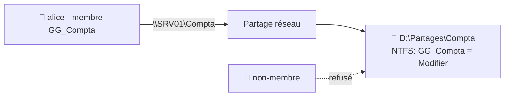

# TP04 — Serveur de fichiers & droits NTFS

🎯 **Objectif** : partager un dossier et régler les **droits NTFS** via un groupe, en
appliquant le moindre privilège. 🕐 Durée : ~35 min · Prérequis : TP03, admin 06.

> On continue sur `SRV01` / `labo.local` avec le groupe `GG_Compta` du TP03.

---

## 🧱 Ce que tu vas construire

---

## 1. Créer le dossier

Sur `SRV01`, crée l'arborescence : `D:\Partages\Compta`
*(si tu n'as qu'un disque C:, utilise `C:\Partages\Compta`.)*

## 2. Partager le dossier (la porte de l'immeuble)

1. Clic droit sur le dossier `Compta` → **Propriétés** → onglet **Partage** → **Partage
   avancé**.
2. Coche **« Partager ce dossier »** (nom du partage : `Compta`).
3. **Autorisations** (partage) : donne **« Utilisateurs authentifiés » = Contrôle total**.
   *(On fera le réglage fin en NTFS — méthode recommandée, admin 06.)*

## 3. Régler les droits NTFS (la porte du bureau) ⭐

1. Onglet **Sécurité** → **Modifier** → **Ajouter** → tape **`GG_Compta`** → OK.
2. Sélectionne `GG_Compta` → coche **« Modifier »** (lecture + écriture).
3. **Retire les accès trop larges** si présents (ex : le groupe « Utilisateurs » en écriture)
   pour respecter le **moindre privilège**. Garde les Administrateurs en Contrôle total.

## 4. Tester l'accès

1. Connecte-toi (sur le serveur ou une VM poste) en tant que **`alice.martin`** (membre de
   `GG_Compta`).
2. Dans l'explorateur, tape `\\SRV01\Compta` : tu dois **pouvoir créer un fichier**. ✅
3. Connecte-toi avec un utilisateur **non membre** → l'accès doit être **refusé**. ✅

> 💡 Si le résultat te surprend, souviens-toi : **partage + NTFS se combinent, le plus
> restrictif gagne** (admin 06). Et vérifie l'**héritage** (bouton Avancé).

## 5. Bonus : couper l'héritage sur un sous-dossier sensible

1. Crée `D:\Partages\Compta\Paie`.
2. Sécurité → **Avancé** → **Désactiver l'héritage** → *« Convertir… »*.
3. Retire `GG_Compta`, ajoute un groupe `GG_Direction` en **Modifier**.
   → La « Paie » n'est plus visible par toute la compta, seulement par la direction.

---

## ✅ Réussite

Un membre de `GG_Compta` accède en écriture ; un non-membre est refusé ; la « Paie » est
cloisonnée. Tu sais monter un **serveur de fichiers propre**, la prestation la plus demandée.

## 🧠 Retiens la méthode

**Droits aux groupes, réglage fin en NTFS, moindre privilège, attention à l'héritage.** Ces
4 réflexes t'éviteront 90 % des erreurs de droits.

---

⬅️ [TP03](tp03-ad-utilisateurs-gpo.md) · ➡️ [TP05 — Serveur Linux (Ubuntu) : SSH](tp05-ubuntu-server-ssh.md)
