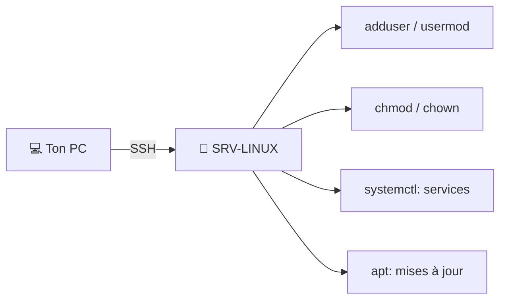

# TP05 — Un serveur Linux (Ubuntu) : SSH, utilisateurs, services

🎯 **Objectif** : installer Ubuntu Server dans une VM, s'y connecter en **SSH**, gérer des
**utilisateurs** et un **service**. 🕐 Durée : ~45 min · Prérequis : TP01, admin 07.

> Pas d'interface graphique ici : on travaille **en ligne de commande**, comme sur un vrai
> serveur Linux. C'est l'objectif du TP : s'y habituer.

---

## 1. Créer la VM Ubuntu Server

1. Télécharge l'**ISO de Ubuntu Server LTS** (gratuit, ubuntu.com) — la version « LTS » =
   support long, celle qu'on met en production.
2. VirtualBox → **Nouvelle** → `SRV-LINUX` · Linux / Ubuntu 64-bit · RAM **2048 Mo** ·
   disque **20 Go** · réseau **Réseau interne `labo`** (ou Accès par pont pour SSH facile).
3. Branche l'ISO, démarre, suis l'installateur : clavier FR, **installe OpenSSH server**
   quand c'est proposé (coche la case !), crée ton utilisateur (ex : `admin-labo`).

## 2. Premiers repères (dans la console de la VM)

Connecte-toi avec ton utilisateur, puis :

```bash
pwd            # où suis-je
ls -l          # contenu du dossier
whoami         # mon compte
id             # mes groupes
ip a           # mon adresse IP  (note-la : ex 10.0.0.50)
```

## 3. Se connecter en SSH (depuis ton PC)

Depuis le terminal de ton PC hôte (PowerShell, Terminal) :

```bash
ssh admin-labo@10.0.0.50      # remplace par l'IP notée
```

> 🎉 Tu administres maintenant le serveur **à distance**, comme en vrai. Tu n'as plus besoin
> de la fenêtre de la VM.

## 4. Gérer des utilisateurs

```bash
sudo adduser bob                 # créer l'utilisateur bob
sudo usermod -aG sudo bob        # donner à bob le droit d'admin (sudo)
id bob                           # vérifier ses groupes
```

> 💡 `sudo` = exécuter en administrateur (admin 07). Tu dois taper ton mot de passe.

## 5. Jouer avec les droits de fichiers

```bash
touch rapport.txt                # créer un fichier
ls -l rapport.txt                # voir ses droits (rwx)
chmod 640 rapport.txt            # proprio: rw / groupe: r / autres: rien
sudo chown bob:bob rapport.txt   # changer propriétaire et groupe
ls -l rapport.txt                # vérifier
```

## 6. Gérer un service

Le service SSH tourne déjà. Observe et pilote-le :

```bash
sudo systemctl status ssh        # état (actif ?)
sudo systemctl restart ssh       # redémarrer
sudo systemctl enable ssh        # démarrage auto au boot
```

## 7. Mettre à jour le serveur

```bash
sudo apt update && sudo apt upgrade
```



---

## ✅ Réussite

Tu as installé un serveur Linux, tu t'y connectes en **SSH**, tu gères **utilisateurs,
droits, services et mises à jour**. Avec ça, tu peux administrer un NAS, un Raspberry Pi,
un serveur web… la plupart des équipements Linux d'un réseau.

## 🧠 Astuce sécurité (admin 10)

Plus tard, configure une **clé SSH** (connexion sans mot de passe, plus sûre) et **désactive
la connexion root directe**. Ce sont les premiers gestes de durcissement d'un serveur Linux.

---

⬅️ [TP04](tp04-serveur-fichiers-ntfs.md) · ➡️ [TP06 — Scénario d'administration complet](tp06-scenario-admin.md)
