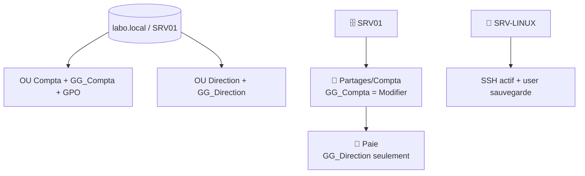

# TP06 — Scénario d'administration complet

🎯 **Objectif** : jouer l'infogéreur de A à Z sur un cas réaliste, en combinant tout ce que
tu as appris. 🕐 Durée : ~60 min · Prérequis : TP02 à TP05, section administration complète.

> 🎓 L'épreuve finale de l'administration. Elle reprend le **Cabinet Durand** (cas pratique)
> transposé dans ton labo virtuel.

---

## 🏢 Le contexte

Le Cabinet Durand t'a confié son informatique. Dans ton labo, tu as `SRV01` (domaine
`labo.local`). Tu dois **mettre en place une organisation propre et sécurisée** pour la
compta.

---

## 🎯 Les missions (fais-les dans l'ordre, coche au fur et à mesure)

### Mission 1 — Structurer l'annuaire (admin 04)
- [ ] Crée les OU : **`Compta`**, **`Direction`**.
- [ ] Crée 3 utilisateurs en Compta (`alice.martin`, `bob.leroy`, `chloe.petit`) et 1 en
  Direction (`durand.gerante`).
- [ ] Crée les groupes **`GG_Compta`** et **`GG_Direction`** et affecte les utilisateurs.

### Mission 2 — Appliquer des règles (admin 05)
- [ ] Crée une GPO liée à `Compta` : **verrouillage auto après 10 min**.
- [ ] Vérifie avec `gpresult /r` qu'elle s'applique.

### Mission 3 — Serveur de fichiers (admin 06)
- [ ] Crée et partage `Partages\Compta` : **`GG_Compta` = Modifier** en NTFS, moindre
  privilège respecté.
- [ ] Crée `Partages\Compta\Paie`, **coupe l'héritage**, accès **`GG_Direction` seulement**.
- [ ] Teste : alice accède à Compta mais **pas** à Paie ; la gérante accède à Paie.

### Mission 4 — Un service Linux (admin 07)
- [ ] Sur `SRV-LINUX`, crée un utilisateur `sauvegarde`, connecte-toi en SSH.
- [ ] Vérifie que le service SSH est **actif** et en **démarrage auto**.

### Mission 5 — Entretien & sécurité (admin 09/10)
- [ ] Mets à jour les deux serveurs (`apt upgrade` / Windows Update).
- [ ] Ouvre l'**Observateur d'événements** de `SRV01` : repère une Erreur/Avertissement.
- [ ] Écris le **RPO/RTO** que tu viserais pour ce serveur (admin 10).

---

## 🧩 Schéma cible

---

## 🏆 Bilan

Si tu as coché toutes les cases, tu viens de faire **le travail réel d'un administrateur
infogéreur** : structurer un annuaire, pousser des règles, monter un serveur de fichiers
cloisonné, piloter un serveur Linux, et assurer entretien + sécurité.

## 🧠 Défi bonus

Rédige une **fiche d'intervention** (modèle infogérance) décrivant tout ce que tu as fait
pour « le Cabinet Durand » dans ce TP. Tu relies ainsi la **technique** (ce TP) au
**métier** (facturer/documenter la prestation). 🔗

---

🎉 **Bravo, tu as terminé le track administration !** Tu sais désormais installer et
administrer un réseau d'entreprise, Windows **et** Linux, du compte utilisateur au serveur
sécurisé.

⬅️ [TP05](tp05-ubuntu-server-ssh.md) · 🏁 [Section administration](README.md)
