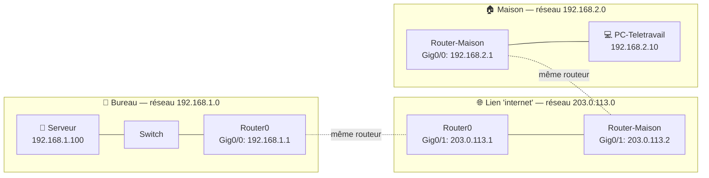

# TP05 — Simuler un accès distant

🎯 **Objectif** : comprendre comment un PC **de l'extérieur** rejoint le réseau de la
TPE, et visualiser le rôle de la box comme frontière.
🕐 Durée : ~30 min · Prérequis : TP04, cours 10 (VPN/accès distant).

> ⚠️ Un vrai VPN ne se configure pas « clic-clic » dans Packet Tracer de base. Ici,
> on **simule le principe** : un site « maison » séparé, relié au bureau par un
> routeur, pour bien **voir la frontière intérieur/extérieur**. L'important est la
> compréhension, pas la techno exacte.

---

## 🧱 Ce que tu vas construire

```
   🏢 BUREAU (TPE)                         🏠 MAISON (télétravail)
   [ Routeur bureau ]───[ lien "internet" ]───[ Routeur maison ]
        │                                             │
     [ Switch ]                                    💻 PC-Teletravail
   💻x5  💾 Serveur
```

Deux « lieux », reliés entre eux. On vérifie que le PC de la maison peut atteindre
le serveur du bureau — comme le ferait un VPN.

---

## 🪜 Étapes (version simplifiée)

### 1. Repartir du TP04

Ouvre `tp04.pkt`. Tu as déjà le **bureau** complet (routeur + switch + 5 PC + serveur).

Pour alléger, tu peux garder seulement **2 PC** côté bureau : ça suffit pour le test.

### 2. Créer le « côté maison »

- Ajoute un **2e routeur** et renomme-le `Router-Maison`.
- Ajoute **1 PC** et renomme-le `PC-Teletravail`.
- Relie `PC-Teletravail` à `Router-Maison` (câble droit **Copper Straight-Through**, du PC
  vers une interface **GigabitEthernet** du routeur). On règle les adresses juste après.

### 3. Comprendre d'abord : il y a **3 quartiers** (⭐ le point clé)

Avant de câbler, visualise. Ton montage a **trois réseaux différents** (trois
« quartiers », rappel cours 02). Chaque **routeur a deux pieds** : un pied dans son
réseau local, un pied dans le « lien internet » du milieu.



Le **plan complet** à reproduire (chaque interface = une « patte » du routeur) :

| Appareil | Interface | Rôle | Adresse IP | Masque |
|---|---|---|---|---|
| **Router0** (bureau) | Gig0/0 | vers le switch bureau | `192.168.1.1` | `255.255.255.0` *(déjà fait au TP04)* |
| **Router0** (bureau) | **Gig0/1** | lien « internet » | **`203.0.113.1`** | `255.255.255.0` |
| **Router-Maison** | Gig0/0 | vers le PC maison | `192.168.2.1` | `255.255.255.0` |
| **Router-Maison** | **Gig0/1** | lien « internet » | **`203.0.113.2`** | `255.255.255.0` |
| **PC-Teletravail** | — | poste maison | `192.168.2.10` | `255.255.255.0` (passerelle `192.168.2.1`) |

#### Câbler le lien entre les deux routeurs
- Relie **Router0 (Gig0/1)** ↔ **Router-Maison (Gig0/1)** avec un câble
  **« Copper Cross-Over »** (croisé, car routeur↔routeur).
  > 💡 Sur Router0, l'interface **Gig0/0 est déjà prise** par le switch du bureau → d'où
  > l'usage de **Gig0/1** pour le lien. Choisis bien une interface **libre**.

#### Régler chaque interface (dans Packet Tracer)
Pour **chaque** ligne du tableau : clique le routeur → onglet **Config** → dans la colonne
de gauche, clique l'**interface** concernée (ex. `GigabitEthernet0/1`) → saisis
**IP Address** + **Subnet Mask** → et **coche `Port Status: On`** (sinon la patte reste
éteinte, erreur classique !).

Puis le PC maison : clique `PC-Teletravail` → **Desktop → IP Configuration → Static** →
IP `192.168.2.10`, masque `255.255.255.0`, **Default Gateway `192.168.2.1`**.

#### ✅ Vérification intermédiaire (avant les routes)
Depuis `PC-Teletravail` → Command Prompt :
- `ping 192.168.2.1` → ta passerelle (Router-Maison) répond ? ✅ *(ton réseau maison est bon)*
- `ping 203.0.113.1` → le routeur bureau répond ? ✅ *(le lien marche)*
- `ping 192.168.1.100` → **échoue encore** ❌ → **c'est normal !** On règle ça à l'étape 4.

### 4. Apprendre aux routeurs le chemin (les routes statiques)

#### Pourquoi le ping échoue encore
Un routeur **ne connaît QUE les réseaux branchés directement sur ses pattes**. Donc :
- `Router0` connaît `192.168.1.0` (bureau) et `203.0.113.0` (lien)… mais **ignore
  l'existence de `192.168.2.0` (maison)**.
- `Router-Maison` connaît `192.168.2.0` et `203.0.113.0`… mais **ignore `192.168.1.0`
  (bureau)**.

Quand le serveur du bureau veut **répondre** au PC maison (`192.168.2.10`), `Router0`
regarde sa table, ne trouve pas ce quartier, et **jette le paquet**. Il faut lui
**donner l'itinéraire**.

> 💡 Analogie : une **route statique**, c'est un **point GPS** qu'on ajoute au routeur :
> « pour aller au quartier *X*, passe par le voisin *Y* ».

#### Ajouter les routes (dans Packet Tracer)
Clique le routeur → onglet **Config** → colonne de gauche, section **ROUTING → Static**.
Trois champs à remplir, puis **Add** :
- **Network** = le réseau **de destination** (où on veut aller)
- **Mask** = son masque
- **Next Hop** = l'IP du **routeur voisin** par qui passer (l'autre bout du lien)

**Sur `Router0` (bureau)** — « pour atteindre la maison, passe par Router-Maison » :
| Network | Mask | Next Hop |
|---|---|---|
| `192.168.2.0` | `255.255.255.0` | `203.0.113.2` |

**Sur `Router-Maison`** — « pour atteindre le bureau, passe par Router0 » :
| Network | Mask | Next Hop |
|---|---|---|
| `192.168.1.0` | `255.255.255.0` | `203.0.113.1` |

> ⚠️ **Il faut LES DEUX routes.** Une pour **l'aller** (la demande du PC → serveur) et une
> pour **le retour** (la réponse du serveur → PC). Avec une seule, le ping échoue (le
> paquet part mais ne revient pas). C'est l'erreur la plus fréquente de ce TP.

<details>
<summary>⌨️ Variante en ligne de commande (onglet CLI) — optionnel</summary>

<br>

Sur `Router0` :
```
enable
configure terminal
ip route 192.168.2.0 255.255.255.0 203.0.113.2
end
```
Sur `Router-Maison` :
```
enable
configure terminal
ip route 192.168.1.0 255.255.255.0 203.0.113.1
end
```
*(C'est exactement ce que fait l'écran « Static Routing », mais en tapant la commande.)*

</details>

### 5. Tester l'accès distant

> ⚠️ **D'abord en mode `Realtime`** (bas à droite) pour le test : le `ping` répond tout de
> suite. (Le mode Simulation, c'est juste pour l'astuce visuelle ci-dessous.)

Depuis `PC-Teletravail` → **Desktop → Command Prompt** :
- `ping 192.168.1.100` (le serveur du bureau) → **Reply from…** ✅ 🎉

Le PC de la maison atteint le serveur du bureau **à travers « internet »**, exactement
comme le ferait un VPN.

> 👀 **Astuce visuelle** : passe en **mode Simulation** (bouton en bas à droite de Packet
> Tracer), relance le ping, et **regarde l'enveloppe voyager** : PC maison → Router-Maison
> → lien → Router0 → switch → serveur, puis le retour. C'est le routage **en images**.

<details>
<summary>🩺 Le ping échoue ? La check-list</summary>

<br>

- [ ] Toutes les interfaces sont en **`Port Status: On`** (pattes allumées) ?
- [ ] Les **deux** routes statiques sont bien ajoutées (une sur **chaque** routeur) ?
- [ ] Le PC maison a la bonne **passerelle** (`192.168.2.1`) ?
- [ ] Le serveur bureau a bien sa passerelle `192.168.1.1` (réglée au TP04) ?
- [ ] Les câbles ont des **points verts** (liaison OK) aux deux bouts ?
- [ ] `ping 203.0.113.1` depuis la maison marche (le lien) mais pas le serveur → il manque
  (ou une route est fausse) côté **routes statiques**.

</details>

---

## ✅ Réussite

Le PC « maison » atteint le serveur « bureau ». Tu as visualisé la **frontière
intérieur/extérieur** et le fait qu'un accès distant **relie deux réseaux**.

## 🧠 À retenir côté réalité

Dans une vraie TPE, on ne poserait **pas** de routes manuelles sur internet : on
monterait un **VPN** (box, NAS, ou Tailscale) qui crée le tunnel sécurisé
automatiquement (cours 10). Ce TP illustre le **principe** ; le VPN, c'est la
version **sécurisée et chiffrée** de ce que tu viens de faire.

> 💾 Enregistre sous `tp05.pkt`.

---

⬅️ [TP04](tp04-reseau-tpe-complet.md) · ➡️ [TP06 — Scénario de panne](tp06-scenario-panne.md)
