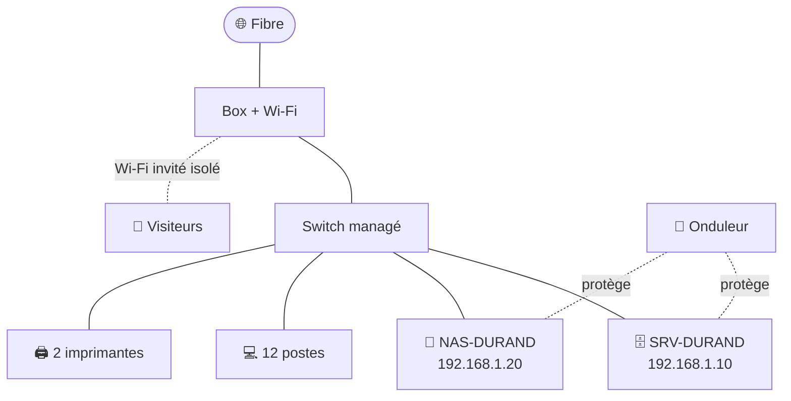

# 📂 Cas pratique — Dossier client (rempli)

> Exemple rempli du [modèle vierge](../exploitation/modeles/modele-dossier-client.md).
> ⚠️ Aucun mot de passe en clair : ils sont dans le coffre (section 5 = **références**).

---

# Dossier client — Cabinet comptable Durand

**Dernière mise à jour :** 05/04/2025   **Tenu par :** [Toi]

## 1. Fiche d'identité
- Raison sociale / SIRET : Cabinet comptable Durand / …
- Adresse : 14 rue des Comptes, 69000 Lyon
- Dirigeant : Mme Durand · Référent interne IT : Mme Durand
- Horaires d'ouverture : lun-ven 8h30-18h30
- Email / tél helpdesk client : support@[ton-entreprise].fr / 04 xx xx xx xx

## 2. Contrat
- Formule : ☑ Confort
- Périmètre : 12 postes, 1 serveur, 1 NAS, 2 imprimantes
- SLA : critique 1h/4h · majeur 4h/1j · mineur 1j
- Exclusions principales : nouveau matériel, projets, formation, déménagement
- Début / échéance : 01/04/2025 / 31/03/2026 (tacite)

## 3. Inventaire matériel

| Nom machine | Rôle | Modèle / Âge | Système | N° série |
|---|---|---|---|---|
| PC-ACCUEIL | Poste accueil | Dell OptiPlex / 3 ans | Windows 11 | FR8K2L1 |
| PC-COMPTA-01…06 | Postes compta | HP / 2-4 ans | Windows 11 | (annexe) |
| PC-COMPTA-07 | Poste compta | **neuf (remplacé 03/2025)** | Windows 11 | NEW-07 |
| PORT-01 / 02 | Portables | Lenovo / 2 ans | Windows 11 | — |
| SRV-DURAND | Serveur compta + fichiers | Tour / 6 ans | Windows Server 2016 | SRV-DUR |
| NAS-DURAND | Archives + sauvegarde locale | Synology 2 baies (RAID 1) | DSM | NAS-DUR |

## 4. Plan réseau
- Box fibre (IP admin `192.168.1.1`) · Switch (remplacé par **switch managé** 04/2025)
- Plage IP : `192.168.1.0/24` (DHCP box, `.1` à `.99` réservé serveurs/matériel fixe)
- Serveur `192.168.1.10` · NAS `192.168.1.20` · Imprimantes `.30`, `.31`
- Wi-Fi : SSID « DURAND » (WPA2, bureau) + **SSID « DURAND-INVITE »** (réseau invité isolé)

Schéma :

## 5. Comptes & accès *(références — secrets dans le coffre)*
- Admin serveur / postes → Coffre › Durand › Admin
- Box / Wi-Fi → Coffre › Durand › Box
- NAS Synology → Coffre › Durand › NAS
- Messagerie opérateur → Coffre › Durand › Mail
- Fournisseurs : registrar domaine → Coffre › Durand › Domaine

## 6. Fournisseurs & contrats tiers
- Nom de domaine : registrar [à récupérer — en cours], échéance à confirmer
- Hébergeur / site web : site vitrine chez l'opérateur
- Opérateur internet / téléphonie : [opérateur fibre]
- Logiciel métier : [éditeur compta], contrat de support n° …

## 7. Procédures spécifiques à ce client
- La **sauvegarde cloud** tourne chaque nuit à 22h ; **test de restauration le 1er lundi
  du mois**.
- Le **logiciel de compta** nécessite que le service "XYZ" soit lancé sur le serveur
  après chaque redémarrage (vérifier).
- Clôtures comptables : **ne jamais planifier d'intervention lourde** en période de
  bilans (mai) sans accord de Mme Durand.

## 8. Historique (événements majeurs)
| Date | Événement |
|---|---|
| 12/03/2025 | Audit initial |
| 01/04/2025 | Début du contrat, onboarding |
| 03-04/2025 | Remise à niveau : sauvegarde 3-2-1, onduleur, sécurité, switch managé, poste 07 remplacé |

---

⬅️ [Contrat](04-contrat-rempli.md) · ➡️ [Fiche d'intervention remplie](06-fiche-intervention-remplie.md)
