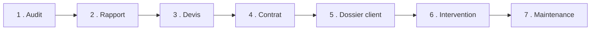

# 🎯 Cas pratique fil rouge — Cabinet comptable Durand

Pour passer de la théorie à l'action, voici **un client fictif réaliste** qu'on suit
**du premier contact jusqu'au suivi mensuel**. Tous les modèles de la section
[infogérance](../infogerance/) et [exploitation](../exploitation/) sont ici **remplis**,
comme si tu avais vraiment géré ce client.

> 💡 Comment l'utiliser : lis les documents **dans l'ordre**, un par un. À chaque
> étape, compare avec le **modèle vierge** correspondant — tu verras concrètement
> comment on le remplit. C'est ton exemple de référence pour tes vrais clients.

---

## 👔 Le client en bref

**Cabinet comptable Durand** — petite entreprise en croissance, à la frontière
TPE/PME. Un cas parfait car il combine **données très sensibles** (RGPD),
**besoin de fiabilité** (si l'info s'arrête, le cabinet s'arrête) et une
**installation laissée à l'abandon** (le classique).

| Info | Valeur |
|---|---|
| Activité | Cabinet d'expertise comptable |
| Effectif | 10 collaborateurs |
| Postes | 10 fixes + 2 portables |
| Serveur | 1 (logiciel de compta + fichiers) |
| NAS | 1 (archives) |
| Téléphonie | 6 postes (ligne classique vieillissante) |
| Imprimantes | 2 (dont 1 multifonction) |
| Internet | Fibre |
| Qui gère l'info ? | « Le neveu du patron », quand il peut |

---

## 📂 Les documents du dossier (dans l'ordre)

| # | Document | Étape |
|---|---|---|
| 1 | [Fiche d'audit remplie](01-fiche-audit-remplie.md) | On fait l'état des lieux |
| 2 | [Rapport d'audit rempli](02-rapport-audit-rempli.md) | On restitue au patron |
| 3 | [Devis rempli](03-devis-rempli.md) | On chiffre |
| 4 | [Contrat rempli](04-contrat-rempli.md) | On contractualise |
| 5 | [Dossier client rempli](05-dossier-client-rempli.md) | On démarre (onboarding) |
| 6 | [Fiche d'intervention remplie](06-fiche-intervention-remplie.md) | Une intervention réelle |
| 7 | [Checklist maintenance remplie](07-checklist-maintenance-remplie.md) | Le suivi mensuel |

> ⚠️ Rappel : chiffres, noms et montants sont **fictifs et pédagogiques**. Les prix
> sont des ordres de grandeur à adapter. Et le contrat reste à faire **relire par un
> juriste** avant tout usage réel.

---

⬅️ [Retour au sommaire](../README.md) · [Section infogérance](../infogerance/)
