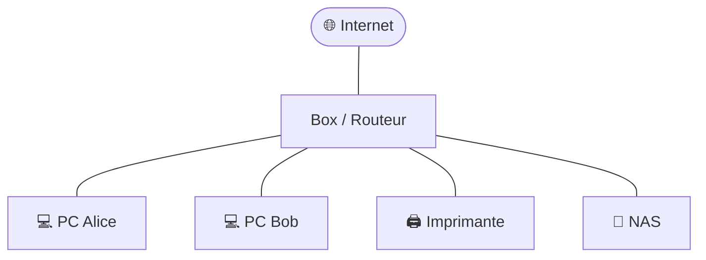

# Cours 01 — C'est quoi un réseau ?

🕐 Lecture : ~5 min · Niveau : débutant total

---

## 🏠 L'analogie du quotidien

Imagine un **immeuble d'habitation**.

- Chaque **appartement**, c'est un **appareil** (un PC, un téléphone, une imprimante…).
- Les **couloirs et escaliers** qui relient les appartements, c'est le **réseau**.
- Le **gardien à l'entrée** qui gère qui entre et sort, c'est le **routeur** (ta box).

Un **réseau**, c'est simplement **plusieurs appareils reliés entre eux pour
s'échanger des informations**. Comme des voisins qui se passent des messages dans
l'immeuble.

---

## 🧩 Un réseau, pour quoi faire ?

Dans une petite entreprise, le réseau sert à :

- 📄 **Partager des fichiers** (le devis est sur le PC d'Alice, Bob veut le lire).
- 🖨️ **Partager une imprimante** (une seule imprimante pour tout le monde).
- 🌐 **Aller sur internet** (tous les PC passent par la même box).
- 💾 **Sauvegarder** les documents importants au même endroit (le NAS).

Sans réseau, chaque PC serait **isolé**, comme un appartement sans porte.

---

## 🖼️ Un petit schéma

Voici à quoi ressemble un réseau de TPE tout simple :

```
                 🌐 Internet
                     |
                 [ Box / Routeur ]
                     |
        -------------------------------
        |          |         |        |
     💻 PC Alice  💻 PC Bob  🖨️ Impr.  💾 NAS
```

Et le **même schéma en Mermaid** (GitHub l'affiche en vrai dessin) :



Tout le monde est relié à la **box** (le routeur), qui est le **point central**.
C'est elle qui fait le lien entre les appareils **et** avec internet.

---

## 🏷️ Deux mots à connaître

- **Réseau local** (on dit aussi **LAN**, pour *Local Area Network*) : c'est ton
  réseau « à la maison » ou « au bureau ». Les appareils proches, reliés à ta box.
- **Internet** : c'est le **réseau des réseaux**, à l'échelle mondiale. Quand tu
  sors de ton immeuble pour aller « dans la ville », tu passes par internet.

> 💡 Résumé image : ton **réseau local** = ton immeuble. **Internet** = la ville entière.

---

## ✅ Ce qu'il faut retenir

1. Un **réseau** = plusieurs appareils reliés pour **échanger des infos**.
2. Dans une TPE, la **box (routeur)** est le **point central** de tout.
3. **Réseau local (LAN)** = chez toi ; **internet** = le monde entier.

## 🔧 À essayer

Regarde autour de toi (chez toi ou au bureau) et **compte les appareils reliés à
ta box** : PC, téléphones, TV connectée, imprimante, enceinte connectée…
Tu viens de recenser ton **réseau local**. Combien en as-tu trouvé ?

> ➡️ Fais ensuite l'[exercice 01](../../exercices/01-c-est-quoi-un-reseau.md).

---

⬅️ [Sommaire](../../README.md) · ➡️ [Cours 02 — Les adresses IP](../02-adresses-ip/)
