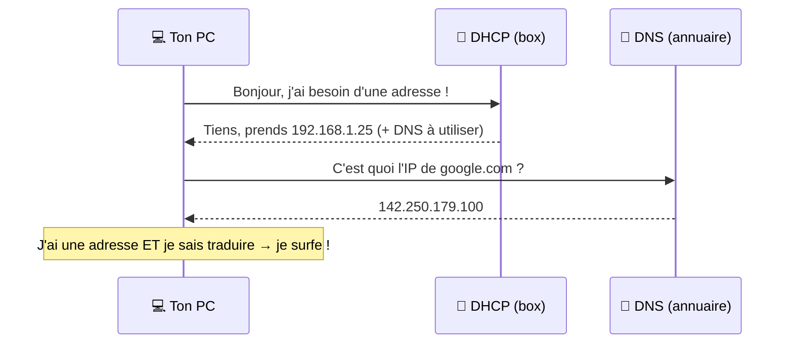

# Cours 03 — DNS et DHCP

🕐 Lecture : ~6 min · Niveau : débutant

Deux « assistants » invisibles qui te facilitent la vie tous les jours. On les
voit l'un après l'autre.

---

## 📇 Le DNS — l'annuaire téléphonique

### L'analogie

Tu veux appeler « Pizzeria Bella ». Tu ne connais pas son numéro par cœur, alors
tu regardes dans ton **répertoire** : le nom → le numéro.

Le **DNS** (*Domain Name System*) fait exactement pareil, mais pour internet :
il **traduit un nom de site en adresse IP**.

```
  Tu tapes :  www.google.com
                    │
              [ DNS = annuaire ]
                    │
  Il répond :  142.250.179.100   ← l'adresse IP réelle du site
```

Sans DNS, il faudrait retenir `142.250.179.100` au lieu de `google.com`.
Imagine retenir le **numéro** de chaque site au lieu de son **nom** : impossible !

### Ce qu'il faut savoir en TPE

- Les PC utilisent en général le DNS de ta box ou celui du fournisseur d'accès.
- Des DNS gratuits connus : **1.1.1.1** (Cloudflare) ou **8.8.8.8** (Google).
- Un problème DNS = « internet marche mais aucun site ne s'ouvre ». Bon à savoir
  pour le dépannage (cours 11).

---

## 🎫 Le DHCP — le distributeur d'adresses

### L'analogie

Tu arrives dans un **parking** avec gardien. Tu n' as pas à choisir ta place :
le gardien te dit « allez à la place n°25 ». Quand tu repars, la place se libère
pour quelqu'un d'autre.

Le **DHCP** (*Dynamic Host Configuration Protocol*) fait pareil : quand un appareil
se connecte, il lui **donne automatiquement une adresse IP libre**.

```
  Nouveau PC :  "Bonjour, j'ai besoin d'une adresse !"
                          │
                   [ DHCP = le gardien ]
                          │
  Réponse :      "Tiens, prends le 192.168.1.25"
```

### Pourquoi c'est génial

Sans DHCP, il faudrait **attribuer à la main** une IP à chaque appareil (et éviter
les doublons). Avec DHCP, **tout est automatique** : tu branches, ça marche.

Dans une TPE, c'est **ta box qui joue le rôle de DHCP** par défaut.

---

## 🤝 DNS + DHCP ensemble

Quand ton PC se connecte, en quelques secondes et sans que tu fasses rien :

1. Le **DHCP** lui donne une **adresse IP** (sa place).
2. Il lui indique aussi **quel DNS utiliser** (quel annuaire consulter).

Résultat : ton PC a une adresse **et** sait traduire les noms de sites. Prêt à
surfer. ✨

Le tout, en **Mermaid**, se lit comme une petite conversation :



---

## ✅ Ce qu'il faut retenir

1. **DNS = l'annuaire** : il traduit un **nom** (google.com) en **adresse IP**.
2. **DHCP = le gardien de parking** : il **donne automatiquement une IP** aux appareils.
3. Dans une TPE, **la box fait les deux** par défaut.

## 🔧 À essayer

- **Windows** : ouvre `cmd` et tape `ipconfig /all`. Cherche les lignes
  **« Serveur DHCP »** et **« Serveurs DNS »**. Tu vois qui te sert d'annuaire et
  de gardien (souvent l'adresse de ta box, type `192.168.1.1`).
- Ensuite, tape `nslookup google.com` : tu verras le DNS traduire le nom en IP,
  en direct !

> ➡️ Fais ensuite l'[exercice 03](../../exercices/03-dns-dhcp.md).

---

⬅️ [Cours 02](../02-adresses-ip/) · ➡️ [Cours 04 — Le routeur / la box](../04-le-routeur-box/)
