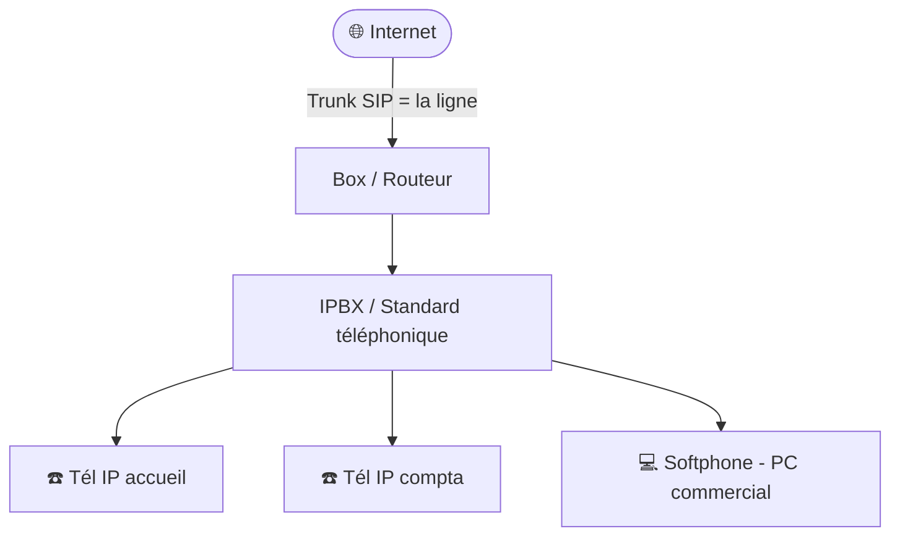

# Cours 12 (bonus) — La téléphonie VoIP

🕐 Lecture : ~7 min · Niveau : débutant · 🎁 Module bonus

---

## ☎️ L'analogie du quotidien

Avant, le téléphone de l'entreprise passait par une **ligne téléphonique dédiée**
(un fil spécial pour la voix, séparé de l'informatique).

La **VoIP** (*Voice over IP* = « la voix qui passe par internet »), c'est faire
voyager ta voix **sur le même réseau que tes PC**, découpée en petits **paquets de
données**, comme un email ou une page web.

> 💡 Image : au lieu d'avoir **deux tuyaux séparés** (un pour le téléphone, un pour
> internet), on fait tout passer dans **un seul tuyau**. Plus simple, moins cher.

C'est devenu la norme : en France, l'ancien réseau téléphonique classique (le
« RTC ») **ferme progressivement**. Savoir gérer la VoIP fait désormais partie du
métier de support IT en TPE.

---

## 🧩 Les pièces du puzzle

| Élément | C'est quoi, en simple |
|---|---|
| **Téléphone IP** | Un téléphone qui se branche au réseau (câble RJ45), pas à une prise téléphonique. |
| **Softphone** | Une **appli** qui transforme un PC ou un smartphone en téléphone. |
| **IPBX / standard** | Le « **standard téléphonique** » (physique ou dans le cloud) qui gère les appels, les transferts, la messagerie. |
| **Trunk SIP** | La « **ligne** » VoIP fournie par l'opérateur : par là arrivent et partent les appels vers l'extérieur. |
| **SIP** | Le « langage » que les téléphones IP utilisent pour établir les appels. |

---

## 🖼️ Comment ça s'organise

Schéma ASCII :

```
                         🌐 Internet
                             │
                     (Trunk SIP = la ligne)
                             │
                        [ Box / Routeur ]
                             │
                        [ IPBX / standard ]   ← gère les appels internes
                             │
                 ┌───────────┼───────────┐
             ☎️ Tel IP    ☎️ Tel IP    💻 Softphone
             (accueil)    (compta)     (PC commercial)
```

Même schéma en **Mermaid** (rendu automatiquement sur GitHub) :



Les téléphones sont des **appareils du réseau comme les autres** : ils ont une
adresse IP (souvent donnée par le DHCP, rappel cours 03).

---

## ⚡ Le point clé en TPE : la qualité de la voix (QoS)

Une page web qui met 1 seconde de plus à charger : personne ne le remarque. Mais une
**voix qui se hache** pendant un appel client : c'est tout de suite gênant. 😬

La voix est **prioritaire et fragile**. Deux réflexes :

1. **Une connexion internet suffisante et stable** (la fibre est idéale).
2. La **QoS** (*Quality of Service*) : on configure la box/le réseau pour **donner la
   priorité à la voix** par rapport au reste du trafic.

> 💡 Image : la QoS, c'est une **voie réservée** (comme les voies de bus) pour que la
> voix ne soit jamais coincée dans les bouchons de données.

---

## 💰 Pourquoi les TPE adorent la VoIP

- **Moins cher** : un seul abonnement réseau, souvent appels illimités inclus.
- **Souple** : ajouter une ligne = ajouter un téléphone, sans travaux.
- **Nomade** : le softphone permet de répondre au numéro du bureau **depuis chez soi**
  ou en déplacement (lien direct avec le VPN du cours 10 !).
- **Fonctions avancées** : standard automatique, renvois, messagerie vocale par email…

> ⚠️ Revers de la médaille : **si internet tombe, le téléphone tombe aussi.** D'où
> l'importance d'une connexion fiable (et parfois d'une solution de secours 4G).

---

## ✅ Ce qu'il faut retenir

1. La **VoIP** fait passer la **voix sur le réseau internet**, en paquets de données.
2. Il faut une **bonne connexion** et activer la **QoS** (priorité à la voix) pour une
   qualité d'appel irréprochable.
3. C'est **économique et souple**, mais **dépendant d'internet** : pas de net, pas de
   téléphone.

## 🔧 À essayer

Tu utilises peut-être déjà de la VoIP sans le savoir ! Regarde ta **box internet** :
le téléphone fixe de la maison est-il branché **sur la box** (prise « Tel » de la
box) plutôt que sur une prise téléphonique murale ? Si oui, bravo : tu téléphones
déjà en VoIP. 🎉 Repère aussi, dans l'interface de la box, s'il existe une section
« Téléphonie » ou « QoS ».

> ➡️ Fais ensuite l'[exercice 12](../../exercices/12-voip-telephonie.md).

---

⬅️ [Cours 11](../11-diagnostic-depannage/) · 🏁 [Retour au sommaire](../../README.md)
