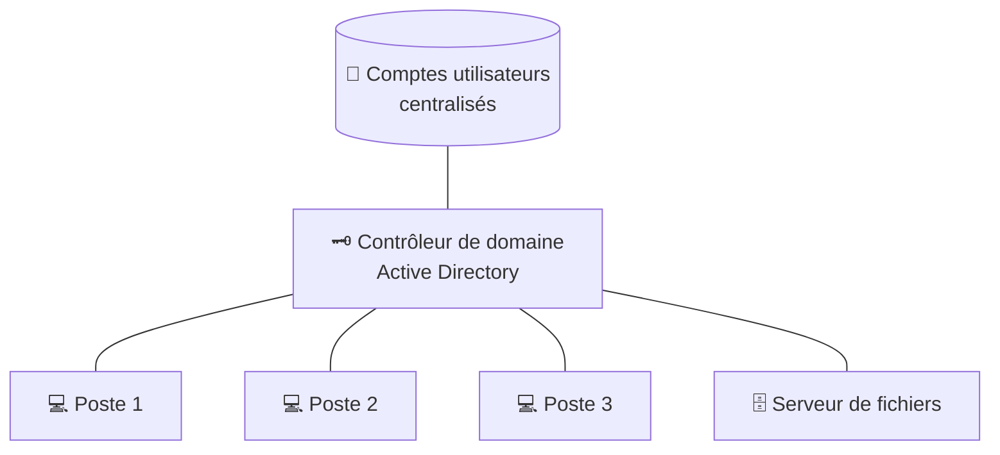

# Cours 13 — Active Directory & le domaine

🕐 Lecture : ~7 min · Niveau : intermédiaire · 🏢 Spécial PME

> C'est **le** concept qui distingue une PME d'une TPE. En TPE, chaque PC vit sa vie ;
> en PME, on **centralise**.

---

## 🏨 L'analogie du quotidien

Imagine la différence entre :

- **Plusieurs maisons individuelles** (TPE) : chacun gère sa serrure, ses clés, ses
  règles. Si Paul change de maison, il doit tout reconfigurer.
- **Un grand hôtel avec une réception centrale** (PME) : une seule réception crée les
  badges, ouvre/ferme les accès, applique les règles à toutes les chambres. Un employé
  arrive ? Un badge, et il accède à ce qui le concerne, **sur n'importe quel poste**.

Cette **réception centrale**, c'est l'**Active Directory (AD)**, et l'« hôtel » qu'elle
gère s'appelle le **domaine**.

---

## 🗝️ C'est quoi Active Directory

**Active Directory** est le service (de Microsoft) qui **centralise la gestion des
utilisateurs et des ordinateurs** d'une entreprise. Il tourne sur un serveur spécial
appelé **contrôleur de domaine**.

Avec un domaine :

- **Un seul compte** par employé, qui fonctionne sur **tous** les postes de l'entreprise.
- La **réception** (l'admin) crée/supprime les comptes **au même endroit**.
- Les **droits** (qui accède à quoi) sont gérés de façon centralisée.

---

## 📏 Les GPO : des règles pour tous, d'un coup

Les **GPO** (*Group Policy Objects* = « stratégies de groupe ») permettent d'**appliquer
des règles à tout le parc depuis la réception** :

- Imposer un fond d'écran, des raccourcis, une imprimante par défaut.
- Forcer des règles de **sécurité** (mot de passe complexe, verrouillage auto).
- Interdire l'installation de logiciels, bloquer les clés USB…

> 💡 Au lieu de configurer 30 PC un par un, tu écris **une** règle : elle s'applique
> partout. C'est un gain de temps énorme — et la base de l'homogénéité d'une PME.

---

## 🆚 TPE (groupe de travail) vs PME (domaine)

| | **TPE (groupe de travail)** | **PME (domaine AD)** |
|---|---|---|
| Comptes | locaux, par PC | centralisés |
| Se connecter partout | non | oui, même compte |
| Gérer les droits | PC par PC | d'un seul endroit |
| Règles (GPO) | manuelles | automatiques, globales |
| À partir de… | ~1 à 10 postes | souvent > 10-15 postes |

> 💡 À retenir pour ton métier : quand un prospect dépasse ~10-15 postes ou veut de
> l'homogénéité/sécurité, le **domaine** devient pertinent.

---

## ☁️ Et dans le cloud ? (Entra ID)

De plus en plus, l'AD « classique » est complété ou remplacé par **Microsoft Entra ID**
(ex-Azure AD), sa version **cloud**, liée à Microsoft 365 (cours 19). Le principe
(comptes centralisés) reste le même, mais la « réception » est **dans le cloud**.

---

## ✅ Ce qu'il faut retenir

1. **Active Directory = la réception centrale** d'une PME : comptes et droits
   **centralisés** (le « domaine »).
2. Les **GPO** appliquent des **règles à tout le parc d'un coup**.
3. TPE = groupe de travail (chacun sa maison) ; PME = **domaine** (l'hôtel). Pertinent
   souvent au-delà de ~10-15 postes.

## 🔧 À essayer

Pas besoin de monter un serveur : regarde une **vidéo « Active Directory domain
controller » pour débutants** (10 min) et repère ces 3 écrans : *Users and Computers*
(créer un compte), une *GPO* (une règle), et le rattachement d'un PC au domaine. Tu
reconnaîtras ensuite ces concepts chez un client.

---

⬅️ [Cours 12](../12-voip-telephonie/) · ➡️ [Cours 14 — VLAN & segmentation](../14-vlan-segmentation/)
