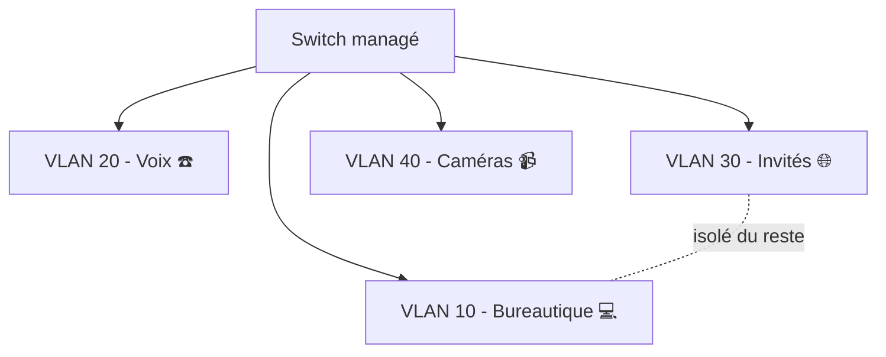

# Cours 14 — VLAN & segmentation réseau

🕐 Lecture : ~6 min · Niveau : intermédiaire · 🏢 Spécial PME

---

## 🏢 L'analogie du quotidien

Imagine un **open space géant** où tout le monde est mélangé : la compta, les visiteurs,
les caméras de surveillance, le Wi-Fi public… Tout le monde entend tout le monde. Pas
idéal.

Un **VLAN**, c'est comme **poser des cloisons** pour créer des **bureaux séparés** dans ce
grand espace, **sans refaire les murs** (sans retirer de câbles). Chaque groupe est
**isolé** des autres, tout en partageant le même bâtiment physique.

---

## 🧩 C'est quoi un VLAN

**VLAN** = *Virtual LAN* = « réseau local **virtuel** ». C'est un moyen de **découper un
même réseau physique en plusieurs réseaux logiques étanches**.

Exemple typique en PME :

| VLAN | Pour quoi | Pourquoi l'isoler |
|---|---|---|
| **Bureautique** | PC des salariés | le cœur de l'activité |
| **Voix (VoIP)** | téléphones IP | leur donner la priorité (QoS) |
| **Invités / Wi-Fi public** | visiteurs | ne doivent **pas** voir le réseau interne |
| **Caméras / objets connectés** | vidéosurveillance, IoT | matériel peu sécurisé, à cloisonner |

---

## 🎯 Pourquoi segmenter (les 3 bénéfices)

1. **Sécurité** : si le Wi-Fi invité ou une caméra est compromis, l'attaquant est
   **coincé dans son VLAN** et n'atteint pas la compta. C'est du **cloisonnement**.
2. **Performance** : moins de « bruit » réseau par segment ; on peut prioriser la voix.
3. **Organisation** : des règles claires par usage, plus simple à administrer.

> 💡 Le cas d'usage qui parle le plus à un client : **« le Wi-Fi des visiteurs ne doit
> jamais pouvoir accéder à vos fichiers internes »**. Le VLAN répond exactement à ça.

---

## 🔧 Ce qu'il faut pour faire des VLAN

- Un **switch managé** (cours 16) — un switch basique ne sait pas faire de VLAN.
- Souvent un **routeur/pare-feu** capable de gérer les VLAN, pour contrôler ce qui passe
  **d'un VLAN à l'autre** (le « routage inter-VLAN »).
- Des points d'accès Wi-Fi qui diffusent plusieurs réseaux (SSID) rattachés à des VLAN.

> 💡 Deux mots que tu croiseras : un port **access** appartient à **un** VLAN (ex : la
> prise d'un PC) ; un port **trunk** transporte **plusieurs** VLAN (ex : le lien entre
> deux switchs ou vers le routeur).

---

## ✅ Ce qu'il faut retenir

1. Un **VLAN** découpe **un réseau physique en plusieurs réseaux isolés** (des cloisons
   virtuelles).
2. Bénéfices : **sécurité** (cloisonnement), **performance**, **organisation**.
3. Il faut du **matériel managé** (switch managé) ; cas d'école : **isoler le Wi-Fi
   invité** du réseau interne.

## 🔧 À essayer

Dessine (sur papier ou en ASCII) le **plan de VLAN** d'une PME imaginaire de 15 postes
avec : bureautique, téléphonie, Wi-Fi invité et 2 caméras. Attribue un numéro de VLAN et
une plage IP à chacun (ex : VLAN 10 → `192.168.10.0`). Tu viens de concevoir une
segmentation.

---

⬅️ [Cours 13](../13-active-directory-domaine/) · ➡️ [Cours 15 — Le serveur d'entreprise](../15-serveur-entreprise/)
