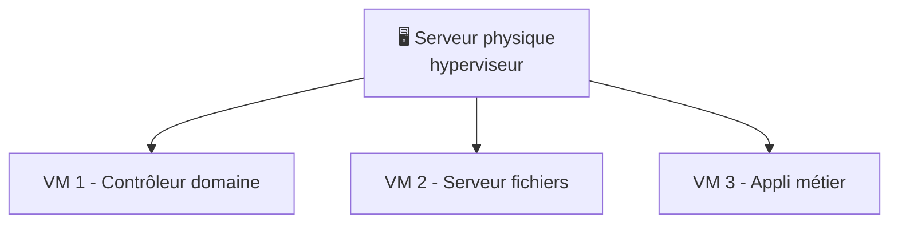

# Cours 15 — Le serveur d'entreprise

🕐 Lecture : ~6 min · Niveau : intermédiaire · 🏢 Spécial PME

---

## 🧑‍🍳 L'analogie du quotidien

Un **serveur**, c'est le **cuisinier d'un restaurant** : il ne mange pas lui-même, il
**prépare et sert** des plats pour tous les clients de la salle. Un serveur informatique
ne « travaille » pas pour un utilisateur : il **rend des services** à tous les postes du
réseau (fichiers, comptes, impression…).

> 💡 Un NAS (cours 07) est un serveur **spécialisé** (fichiers). Un « serveur » d'entreprise
> est plus **polyvalent** : il peut jouer plusieurs rôles à la fois.

---

## 🍽️ Les « plats » qu'un serveur peut servir (les rôles)

| Rôle | Ce qu'il fait |
|---|---|
| **Contrôleur de domaine (AD)** | La « réception » des comptes (cours 13) |
| **Serveur de fichiers** | Les dossiers partagés de l'entreprise, avec droits fins |
| **Serveur d'impression** | Centralise les imprimantes |
| **DHCP / DNS** | Distribue les IP, l'annuaire interne (cours 03) |
| **Applicatif / métier** | Héberge un logiciel métier, une base de données |
| **Sauvegarde** | Point central de sauvegarde |

Un même serveur peut cumuler plusieurs rôles (selon sa puissance).

---

## 🧱 Serveur physique vs virtuel

- **Serveur physique** : une vraie machine dédiée (puissante, fiable, disques en RAID).
- **Virtualisation** : sur **une** machine physique, on fait tourner **plusieurs serveurs
  virtuels** (VM) isolés. C'est **la norme** aujourd'hui.

> 💡 Image : la virtualisation, c'est **plusieurs appartements (VM) dans un même
> immeuble (serveur physique)**. Avantages : mieux utiliser le matériel, isoler les
> services, sauvegarder/déplacer une VM facilement. Outils : **Proxmox** (gratuit),
> **VMware**, **Hyper-V**.

---

## ⚖️ Serveur local ou cloud ?

Vraie question en PME aujourd'hui :

- **Serveur local (on-premise)** : tu maîtrises tout, pas d'abonnement mensuel, mais
  investissement matériel + maintenance + risque physique (il faut le sauvegarder et le
  protéger).
- **Cloud** (serveur loué, ou services SaaS — cours 18/19) : pas de matériel, évolutif,
  mais abonnement récurrent et dépendance à internet.

Souvent un **mix** : fichiers/compta en local, messagerie et collaboration dans le cloud.

> 💡 Rôle de l'infogéreur : **conseiller le bon équilibre** selon le budget, la
> connexion internet et les contraintes métier du client.

---

## 🛡️ Les incontournables d'un serveur

- **Disques en RAID** (cours 07) pour survivre à une panne disque.
- **Onduleur** (cours 17) : un serveur ne doit **jamais** s'éteindre brutalement.
- **Sauvegarde** dédiée (le RAID ne suffit pas — cours 08).
- **Mises à jour** et **supervision** (il est critique : s'il tombe, tout tombe).

---

## ✅ Ce qu'il faut retenir

1. Un **serveur rend des services** à tout le réseau ; il peut cumuler plusieurs **rôles**.
2. La **virtualisation** = plusieurs serveurs virtuels sur une machine physique (la norme).
3. **Local vs cloud** : souvent un **mix** ; un serveur exige **RAID + onduleur +
   sauvegarde + supervision**.

## 🔧 À essayer

Installe **VirtualBox** (gratuit) sur ton PC et crée une **machine virtuelle** avec un
système léger (ex : une distribution Linux). Tu verras concrètement ce qu'est une « VM » :
un ordinateur **dans** ton ordinateur. C'est la porte d'entrée vers la virtualisation.

---

⬅️ [Cours 14](../14-vlan-segmentation/) · ➡️ [Cours 16 — Le switch managé](../16-switch-manage/)
