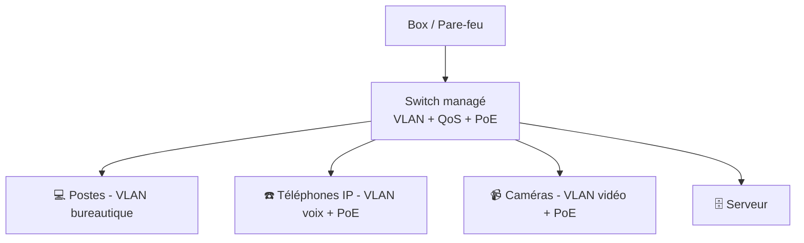

# Cours 16 — Le switch managé

🕐 Lecture : ~5 min · Niveau : intermédiaire · 🏢 Spécial PME

---

## 🚦 L'analogie du quotidien

Rappelle-toi le switch (cours 04) : la **multiprise réseau**. Il en existe deux sortes :

- Le switch **non managé** = une **multiprise bête** : tu branches, ça marche, point.
  Aucun réglage possible.
- Le switch **managé** = un **carrefour avec feux tricolores et agent de circulation** :
  tu peux **organiser, prioriser et surveiller** la circulation.

Dès qu'une PME veut des VLAN ou de la qualité de service, il lui faut un switch **managé**.

---

## 🧠 Ce que le « managé » apporte

| Fonction | À quoi ça sert |
|---|---|
| **VLAN** | Cloisonner le réseau (cours 14) |
| **QoS** | Prioriser la voix (VoIP) ou une appli critique |
| **Supervision** | Voir l'état des ports, le trafic, les pannes |
| **Agrégation de liens** | Cumuler 2 câbles pour plus de débit vers le serveur |
| **Sécurité des ports** | Limiter quels appareils peuvent se brancher |
| **PoE** (souvent) | Alimenter en électricité via le câble réseau |

> 💡 **PoE** (*Power over Ethernet*) : le câble réseau transporte **aussi le courant**.
> Génial pour les **téléphones IP, caméras et bornes Wi-Fi** : un seul câble, pas de prise
> électrique à côté. Un argument qui parle beaucoup en PME.

---

## 🧩 Où il se place

Le switch managé devient le **cœur organisé** du réseau PME, là où se concrétisent les
VLAN et la QoS.

---

## 🛒 Côté achat (pour conseiller un client)

- **Non managé** : quelques dizaines d'euros, pour un petit réseau TPE simple.
- **Managé** : plus cher, mais indispensable dès qu'il y a VLAN / VoIP / caméras /
  plusieurs usages. Marques courantes : Cisco, Ubiquiti (UniFi), Netgear, Zyxel, TP-Link
  (gamme « managée »).
- Pense au **nombre de ports** (prévoir de la marge), au **PoE** si téléphones/caméras, et
  au **débit** (Gigabit minimum).

> 💡 Il existe aussi des switchs « **smart / web-managed** » : un entre-deux moins cher,
> suffisant pour des VLAN simples en petite PME.

---

## ✅ Ce qu'il faut retenir

1. **Non managé = multiprise bête** ; **managé = carrefour réglable** (VLAN, QoS,
   supervision).
2. Le **PoE** alimente téléphones/caméras/bornes **par le câble réseau** (un seul fil).
3. Dès qu'il y a **VLAN, VoIP ou caméras**, il faut un switch **managé** (ou smart).

## 🔧 À essayer

Va voir la fiche d'un switch managé « smart » d'entrée de gamme (ex : gamme UniFi ou
TP-Link Smart) chez un revendeur. Repère dans les specs : **nombre de ports**, **PoE
(budget en watts)**, **Gigabit**, **support VLAN**. Tu sauras lire une fiche pour conseiller
un client.

---

⬅️ [Cours 15](../15-serveur-entreprise/) · ➡️ [Cours 17 — L'onduleur (UPS)](../17-onduleur-ups/)
