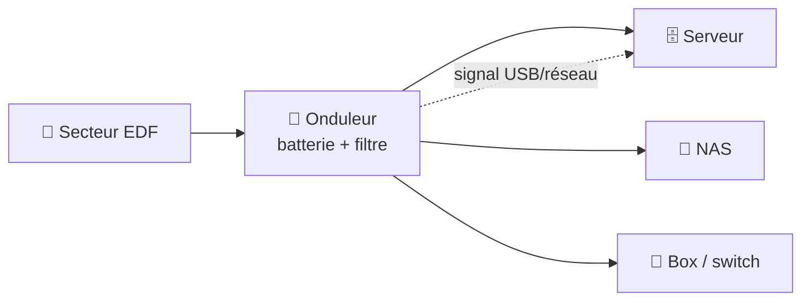

# Cours 17 — L'onduleur (UPS)

🕐 Lecture : ~5 min · Niveau : débutant · 🏢 Utile TPE & PME

---

## 🔋 L'analogie du quotidien

Un **onduleur**, c'est une **batterie de secours + un parapluie électrique** pour tes
appareils critiques. Quand le courant saute, il prend le relais **le temps d'éteindre
proprement** — comme le groupe électrogène d'un hôpital qui démarre en une fraction de
seconde pour que rien ne s'arrête brutalement.

> 💡 Son nom anglais : **UPS** (*Uninterruptible Power Supply* = « alimentation sans
> interruption »).

---

## ⚡ Pourquoi c'est important

Une **coupure de courant brutale** sur un serveur ou un NAS, c'est le pire scénario :

- **Corruption de données** (une écriture en cours = fichiers cassés, base de données
  abîmée).
- **Panne matérielle** (les disques n'aiment pas les arrêts secs).
- **RAID dégradé**, sauvegarde interrompue…

L'onduleur protège aussi des **micro-coupures** et des **surtensions** (orages) qui usent
ou grillent le matériel.

---

## 🛠️ Ce qu'il fait concrètement

1. **Coupure détectée** → la **batterie** prend le relais immédiatement.
2. Un **câble (USB/réseau)** prévient le serveur/NAS : « on est sur batterie ».
3. Si la coupure dure, le serveur **s'éteint proprement tout seul** avant que la batterie
   soit vide. **Zéro perte de données.**

> ⚠️ L'onduleur n'est **pas** fait pour continuer à travailler des heures : il donne **le
> temps d'un arrêt propre** (quelques minutes à dizaines de minutes).

---

## 🎯 Quoi brancher dessus (et quoi éviter)

- ✅ À protéger : **serveur, NAS, box/pare-feu, switch** (le cœur critique).
- ❌ À éviter : **imprimante laser** (elle consomme énormément et vide l'onduleur
  instantanément).

> 💡 Conseil pro : brancher la **box et le switch** sur l'onduleur aussi, pour garder le
> réseau (et donc l'accès distant / la VoIP) actif pendant une courte coupure.

---

## 🔧 Dimensionner et entretenir

- **Puissance** (en VA/W) : doit couvrir la consommation des appareils branchés, avec de
  la marge (un infogéreur calcule ça avant d'acheter).
- **Autonomie** : plus de batterie = plus de temps. À adapter au besoin.
- **Entretien** : les **batteries s'usent** (3-5 ans). À **tester** et remplacer — ça fait
  partie de ta maintenance (checklist mensuelle/annuelle).

---

## ✅ Ce qu'il faut retenir

1. L'onduleur (**UPS**) = **batterie de secours** qui permet un **arrêt propre** lors d'une
   coupure (évite la corruption de données).
2. À mettre sous onduleur : **serveur, NAS, box, switch** ; **jamais** une imprimante
   laser.
3. Les **batteries s'usent** (3-5 ans) : à **tester et remplacer** dans ta maintenance.

## 🔧 À essayer

Repère les appareils **critiques** chez toi ou chez un client (box, NAS…). Sont-ils sur
un onduleur ? Si oui, regarde s'il a un **câble USB** relié à la machine (pour l'arrêt
auto) et un **logiciel** de gestion (ex : NUT, ou l'appli du fabricant). Sinon, tu sais
quoi recommander. 🔋

---

⬅️ [Cours 16](../16-switch-manage/) · ➡️ [Cours 18 — Le cloud & le SaaS](../18-cloud-et-saas/)
