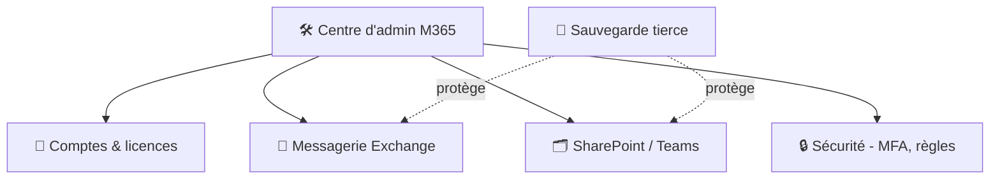

# Cours 19 — Microsoft 365 (et Google Workspace)

🕐 Lecture : ~7 min · Niveau : débutant · ☁️ TPE & PME

> C'est **le** service cloud que tu géreras le plus en TPE/PME. Le maîtriser est
> incontournable pour l'infogérance moderne.

---

## 🧰 L'analogie du quotidien

**Microsoft 365** (ex-Office 365), c'est la **boîte à outils complète du bureau, en
abonnement** : la messagerie pro, Word/Excel/PowerPoint, le stockage en ligne, la visio,
le chat… **tout au même endroit**, accessible de partout.

Son grand concurrent, **Google Workspace**, propose la même idée (Gmail, Docs, Drive,
Meet). Le raisonnement de ce cours s'applique aux deux.

---

## 📦 Ce qu'il y a dans la boîte (M365)

| Outil | Rôle | Équivalent Google |
|---|---|---|
| **Exchange / Outlook** | Messagerie pro (@ton-entreprise.fr) | Gmail |
| **Word / Excel / PowerPoint** | Bureautique (web + installé) | Docs / Sheets / Slides |
| **OneDrive** | Stockage perso en ligne | Drive |
| **SharePoint** | Espaces de fichiers **partagés** d'équipe | Drive partagé |
| **Teams** | Chat, visio, collaboration | Meet / Chat |
| **Entra ID** | Les **comptes** centralisés (cf. cours 13) | Google Admin |

---

## 🗂️ OneDrive vs SharePoint (piège classique à comprendre)

C'est **la** confusion n°1 des utilisateurs :

- **OneDrive** = **ton tiroir personnel** (tes fichiers à toi).
- **SharePoint** = **l'armoire commune de l'équipe** (fichiers partagés du service/projet).

> 💡 Règle simple à transmettre au client : **document perso → OneDrive ; document
> d'équipe → SharePoint** (souvent présenté via Teams). Ça évite que tout atterrisse dans le
> OneDrive d'une personne qui part un jour avec les fichiers.

---

## 🛠️ Le rôle de l'infogéreur sur M365

Tu administres le tenant (l'espace M365 du client) via le **centre d'administration** :

- **Créer / supprimer les comptes** (arrivée / départ de salariés).
- Gérer les **licences** (chaque utilisateur = une licence ; ne pas payer pour des comptes
  inutilisés !).
- Configurer la **messagerie** (domaine, alias, listes de diffusion).
- Mettre en place les **espaces SharePoint/Teams** et les droits.
- **Sécuriser** (point crucial ci-dessous).
- Prévoir la **sauvegarde tierce** des données (rappel cours 18).

---

## 🔒 Sécuriser M365 (le minimum vital)

La messagerie est **la cible n°1** des pirates (phishing, usurpation). À activer
systématiquement :

1. **MFA / 2FA obligatoire** pour tous (surtout les comptes admin). **Le geste le plus
   important.**
2. **Comptes admin séparés** des comptes du quotidien.
3. **Règles anti-spam / anti-phishing** (incluses, à configurer).
4. **Révoquer immédiatement** les comptes des partants (cf. exploitation 06).

> ⚠️ Un compte M365 piraté sans MFA = accès à toute la messagerie + aux fichiers de la
> personne. Le MFA bloque l'immense majorité de ces attaques. **Non négociable.**

---

## 💳 Les licences (côté gestion)

Plusieurs formules (Business Basic, Standard, Premium…) à des prix par utilisateur/mois.
Ton rôle : **choisir la bonne** (Basic = web seulement ; Standard = apps installées ;
Premium = + sécurité avancée) et **optimiser** (supprimer les licences des comptes
inutilisés = économies directes pour le client).

---

## ✅ Ce qu'il faut retenir

1. M365 (ou Google Workspace) = **la boîte à outils bureau en abonnement** : messagerie,
   bureautique, stockage, collaboration, **comptes centralisés**.
2. **OneDrive = perso, SharePoint = équipe** ; côté admin tu gères **comptes, licences,
   sécurité**.
3. Sécurité **non négociable** : **MFA pour tous** ; et toujours une **sauvegarde tierce**
   des données.

## 🔧 À essayer

Microsoft propose un **essai gratuit de M365 Business** (ou regarde une visite du **centre
d'administration** en vidéo). Repère : où on **crée un utilisateur**, où on **attribue une
licence**, et où on **active le MFA**. Ce sont tes 3 gestes d'admin les plus fréquents.

---

⬅️ [Cours 18](../18-cloud-et-saas/) · ➡️ [Cours 20 — Le RGPD pour TPE/PME](../20-rgpd-tpe-pme/)
