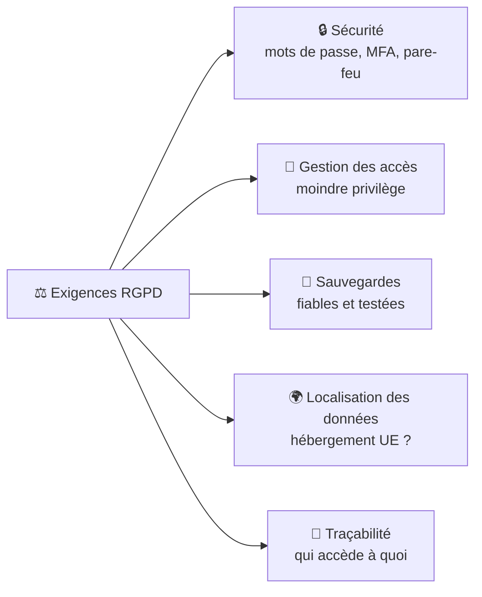

# Cours 20 — Le RGPD pour TPE/PME

🕐 Lecture : ~7 min · Niveau : débutant · ⚖️ Important pour ton métier

> ⚠️ Ce cours est une **sensibilisation**, pas un conseil juridique. Pour les cas précis,
> oriente vers la **CNIL** (cnil.fr) ou un juriste.

---

## 🗄️ L'analogie du quotidien

Les **données personnelles**, c'est comme les **objets qu'un client te confie**. Le RGPD
dit : tu dois savoir **ce qu'on t'a confié**, **le ranger en sécurité**, ne l'utiliser que
pour **ce qui était convenu**, et le **rendre ou le détruire** quand c'est fini. Du bon
sens… mais encadré par la loi.

---

## 📖 C'est quoi le RGPD

Le **RGPD** (*Règlement Général sur la Protection des Données*) est la loi européenne qui
protège les **données personnelles** : toute information se rapportant à une **personne
identifiable** (nom, email, téléphone, adresse, numéro client, photo, IP…).

Il s'applique à **toute** entreprise qui traite ces données — **y compris les TPE/PME**.
Les sanctions peuvent être lourdes (la CNIL contrôle).

> 💡 Pourquoi ça te concerne, toi l'infogéreur ? Parce que tu **accèdes aux données de tes
> clients** (et de leurs clients). Tu es un **sous-traitant** au sens du RGPD : tu as des
> **obligations**.

---

## 🎯 Les grands principes (en clair)

| Principe | En une phrase |
|---|---|
| **Finalité** | Collecter des données pour un **but précis**, pas « au cas où ». |
| **Minimisation** | Ne garder que le **strict nécessaire**. |
| **Consentement / base légale** | Avoir une **raison valable** de traiter la donnée. |
| **Sécurité** | **Protéger** les données (accès, chiffrement, sauvegardes). |
| **Durée limitée** | Ne pas garder indéfiniment ; **supprimer** quand c'est fini. |
| **Droits des personnes** | Accès, rectification, suppression (« droit à l'oubli »). |

---

## 🛠️ Le lien direct avec ton métier IT

Le RGPD, ce n'est pas que du juridique : **une grande partie passe par la technique**, donc
par **toi** :

Autrement dit : **presque tout ce que tu as appris dans cette formation** (sécurité,
accès, sauvegardes) **sert aussi la conformité RGPD**. Bonne nouvelle !

---

## 📋 Ce qu'une TPE/PME doit avoir (l'essentiel)

- Un **registre des traitements** (liste de quelles données, pourquoi, où, combien de
  temps).
- Des **mesures de sécurité** adaptées (ce que tu mets en place).
- Des **contrats** encadrant les sous-traitants (dont **toi** : une clause/annexe RGPD dans
  ton contrat d'infogérance — cf. infogérance 04).
- Une procédure en cas de **violation de données** (fuite, piratage) : notifier la CNIL
  **sous 72 h** dans certains cas.
- Éventuellement un **DPO** (délégué à la protection des données) pour les plus grosses.

> 💡 Opportunité business : beaucoup de TPE/PME sont **perdues** avec le RGPD. Les
> accompagner (volet technique + orientation) est un **service à valeur ajoutée** que tu
> peux proposer.

---

## 🌍 Attention à la localisation des données

Avec le cloud (cours 18/19), les données peuvent être hébergées **hors d'Europe**. Vérifie
que ton fournisseur propose un **hébergement dans l'UE** et des **garanties RGPD**
(Microsoft, Google, OVH… communiquent là-dessus). C'est un point de conseil important.

---

## ✅ Ce qu'il faut retenir

1. Le **RGPD** protège les **données personnelles** et s'applique **à toutes** les
   entreprises ; en tant qu'infogéreur, tu es **sous-traitant** avec des obligations.
2. Une grande partie du RGPD est **technique** : **sécurité, accès, sauvegardes,
   localisation** — ce que tu sais déjà faire.
3. Essentiels : **registre des traitements**, **clause RGPD** dans ton contrat, procédure
   **violation de données (72 h)**, hébergement **UE**.

## 🔧 À essayer

Va sur **cnil.fr** et cherche le guide **« RGPD : par où commencer »** (ou le guide TPE/PME).
Repère les **4 étapes** qu'ils recommandent. Note comment, pour chaque étape, **ton travail
IT** (sécurité, sauvegarde, accès) contribue à la conformité.

---

⬅️ [Cours 19](../19-microsoft-365/) · 🏁 [Retour au sommaire](../../README.md)
