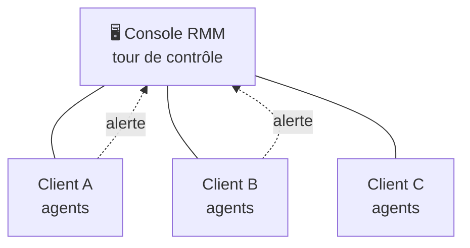

# Exploitation 01 — Supervision & RMM

🕐 Lecture : ~6 min

---

## 🚨 L'analogie du quotidien

La supervision, c'est le **tableau de bord d'une voiture** : le voyant d'huile s'allume
**avant** que le moteur casse. Sans supervision, tu roules sans aucun voyant : tu
découvres la panne quand c'est déjà trop tard (et que le client est furieux).

---

## 👀 C'est quoi superviser

**Superviser**, c'est **surveiller en continu et à distance** l'état des équipements de
tes clients, et être **alerté automatiquement** quand quelque chose cloche :

- Un disque dur bientôt plein ou en pré-panne 🔴
- Une **sauvegarde qui a échoué** la nuit dernière 🔴
- Un antivirus désactivé, des mises à jour en retard 🟠
- Un serveur ou un NAS qui ne répond plus 🔴
- Une imprimante hors ligne

> 💡 L'objectif : **apprendre le problème avant le client.** Appeler le client pour dire
> « j'ai vu que votre sauvegarde a échoué, je corrige » → effet « waouh » garanti.

---

## 🧰 Le RMM : l'outil du métier

**RMM** = *Remote Monitoring and Management* = « surveillance **et** gestion à distance ».
C'est **le** logiciel central de l'infogéreur. Un petit **agent** (programme léger) est
installé sur chaque machine du client et remonte tout vers une **console unique** où tu
vois **tous tes clients d'un coup d'œil**.

Un RMM permet en général de :

- **Superviser** (l'objet de ce module) et **alerter**.
- **Déployer les mises à jour** à distance (patch management).
- **Prendre la main** à distance (lien avec le module 02).
- **Inventorier** automatiquement le parc (matériel + logiciels).
- **Automatiser** des tâches (nettoyage, scripts, redémarrages).

> 💡 Exemples d'outils (à titre indicatif) : **Atera**, **NinjaOne**, **Pulseway**,
> **TacticalRMM** (open source). Compare les prix « par technicien » vs « par
> appareil » : ça change tout quand tu grandis.

---

## 🖥️ La console : ta tour de contrôle

Depuis un seul écran, tu vois l'état de **tout ton portefeuille**. C'est ce qui rend
possible de gérer 10, 20, 50 clients à une ou deux personnes.

---

## ✅ Ce qu'il faut retenir

1. Superviser = **être alerté avant la panne** (le voyant d'huile).
2. Le **RMM** est l'outil central : un agent par machine → une **console unique** pour
   tous les clients.
3. La supervision à surveiller en priorité : **sauvegardes**, **disques**, **antivirus**,
   **équipements injoignables**.

## 🔧 À essayer

Choisis **un** RMM de la liste et regarde sa **démo / version d'essai gratuite**. Repère
3 choses : (1) comment on ajoute un appareil, (2) où s'affichent les **alertes**, (3)
comment configurer une alerte « sauvegarde échouée ». Pas besoin de déployer en vrai :
familiarise-toi avec la logique.

---

➡️ [Exploitation 02 — Prise en main à distance](02-prise-en-main-distance.md)
