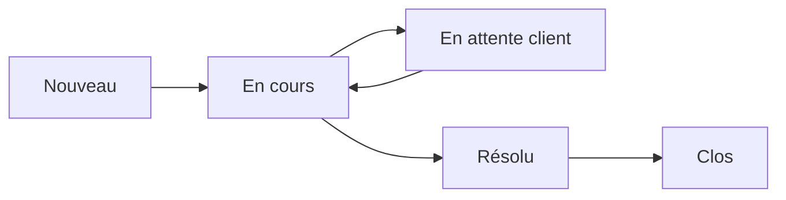

# Exploitation 03 — Ticketing & helpdesk

🕐 Lecture : ~5 min

---

## 🎫 L'analogie du quotidien

Le ticketing, c'est le **carnet de commandes d'un restaurant**. Sans lui, le serveur
oublie une table, sert deux fois la même, et c'est le chaos. Avec, **chaque demande est
notée, suivie, et rien ne se perd**.

En infogérance, chaque demande d'un client = un **ticket**. Dès que tu as plus d'un ou
deux clients, **gérer ça « de tête » ou par email devient ingérable**.

---

## 📥 C'est quoi un helpdesk

Un **helpdesk** (centre d'assistance) centralise toutes les demandes dans un **système de
tickets**. Chaque ticket a :

- un **numéro** (pour s'y référer),
- un **demandeur** et un **client**,
- une **priorité** (🔴 critique / 🟠 majeur / 🟢 mineur — rappel des SLA),
- un **statut** (nouveau → en cours → en attente → résolu → clos),
- un **historique** des échanges et actions.

---

## 🎯 Pourquoi c'est indispensable

- **Rien ne se perd** : chaque demande est tracée jusqu'à sa résolution.
- **Prioriser** : tu traites le 🔴 avant le 🟢, pas « premier arrivé ».
- **Mesurer tes SLA** : le helpdesk calcule tes délais → preuve que tu tiens tes
  engagements (module infogérance 04).
- **Historique** : « c'est la 3ᵉ fois que ce PC plante » → tu décides de le remplacer.
- **Facturation** : les tickets hors forfait sont tracés et facturables.

> 💡 Un seul **canal d'entrée** clair pour le client (une adresse email helpdesk, un
> portail) évite les demandes éparpillées (SMS perso, appels directs…).

---

## 🧰 Outils

Souvent **intégré au RMM** (PSA : *Professional Services Automation*), ou des outils
dédiés : **GLPI** (open source, très répandu en France), **Freshdesk**, **Zammad**,
**osTicket**.

> 💡 **GLPI** fait à la fois **inventaire du parc** + **tickets** : excellent point de
> départ gratuit pour un infogéreur qui démarre.

---

## ✅ Ce qu'il faut retenir

1. Chaque demande = un **ticket** tracé (numéro, priorité, statut, historique).
2. Le helpdesk permet de **prioriser**, **mesurer les SLA** et **ne rien oublier**.
3. Donne au client **un canal d'entrée unique** ; côté outil, **GLPI** est un bon départ
   gratuit.

## 🔧 À essayer

Installe ou teste la **démo de GLPI**. Crée un ticket fictif : donne-lui une priorité,
change son statut « en cours » → « résolu ». Repère où tu verrais la **liste de tous les
tickets ouverts** de tes clients.

---

⬅️ [Exploitation 02](02-prise-en-main-distance.md) · ➡️ [Exploitation 04 — Maintenance préventive](04-maintenance-preventive.md)
