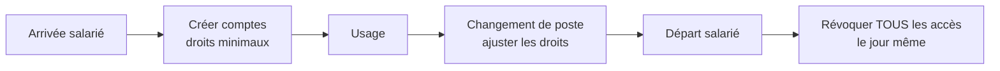

# Exploitation 06 — Gestion des accès & mots de passe

🕐 Lecture : ~6 min · ⭐ Ta responsabilité n°1

---

## 🔑 L'analogie du quotidien

En infogérant plusieurs entreprises, tu deviens le **concierge qui détient les clés de
tous les immeubles du quartier**. C'est une **responsabilité énorme** : si on te vole ton
trousseau, ce ne sont pas tes données qui tombent, mais **celles de tous tes clients à la
fois**.

> ⚠️ C'est LE point qui peut couler ta réputation (et t'exposer juridiquement). À prendre
> extrêmement au sérieux.

---

## 🧰 Le coffre à mots de passe (indispensable)

**Jamais** de mots de passe dans un fichier Excel, un bloc-notes, des post-it ou la doc en
clair. Tu utilises un **gestionnaire de mots de passe professionnel** (coffre chiffré) :

- **Bitwarden** (dont une version self-hosted / Vaultwarden), **KeePass** (gratuit,
  local), **Keeper**, **1Password**, **Passwork**…
- Pour un infogéreur : choisis une solution qui gère **plusieurs organisations / clients**
  et le **partage sécurisé** au sein de ton équipe.

### Les règles d'or

1. **Un mot de passe unique et fort par machine / par service** (jamais le même partout :
   une fuite = une seule porte, pas toutes).
2. **2FA partout** où c'est possible, et **obligatoirement** sur le coffre lui-même et sur
   tes outils centraux (RMM, prise à distance).
3. **Mot de passe maître** du coffre : très long, connu de toi seul, jamais réutilisé.
4. **Séparer par client** (une organisation/collection par client) pour cloisonner.

---

## 🧯 Le compte admin : à manier avec soin

- Les utilisateurs travaillent avec un compte **sans droits admin** (limite les dégâts
  d'un virus).
- Les comptes **admin** sont réservés à l'administration, protégés par 2FA.
- **Principe du moindre privilège** (rappel cours 09) : chacun le strict nécessaire.

---

## 🔄 Le cycle de vie des accès

> ⚠️ Le **départ d'un salarié** est un moment critique : couper **tous** ses accès
> (comptes, VPN, M365, badge…) **le jour même**. Un compte oublié = une porte ouverte.

---

## 🧳 Réversibilité (fin de contrat)

Quand un client part, tu **restitues** proprement ses accès et sa doc, puis tu **retires
tes propres accès** de ton coffre. Pas de « au cas où » : garder des accès après la fin
du contrat est une faute.

---

## ✅ Ce qu'il faut retenir

1. Tu détiens les clés de **tous** tes clients → **coffre chiffré** obligatoire, jamais
   d'Excel/post-it.
2. **Unique + fort par service**, **2FA partout** (surtout coffre, RMM, prise à distance),
   cloisonné par client.
3. Moments critiques : **départ d'un salarié** (révoquer le jour même) et **fin de
   contrat** (restituer puis retirer tes accès).

## 🔧 À essayer

Installe **Bitwarden** (gratuit) et crée ton coffre avec un **mot de passe maître fort** +
**2FA**. Ajoute 3 accès fictifs organisés par « client ». Tu tiens là le socle le plus
important de ton activité d'infogéreur.

---

⬅️ [Exploitation 05](05-documentation-client.md) · 🏁 [Section exploitation](README.md)
