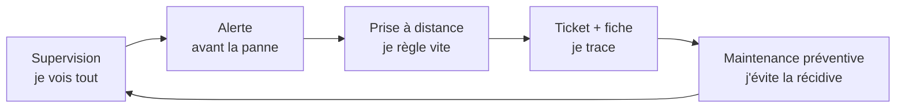

# 🛠️ Exploitation au quotidien — gérer plusieurs clients sans y passer ses nuits

Une fois le client sous contrat, le vrai défi commence : **tenir plusieurs clients à
la fois**, de façon fiable, sans courir partout. Le secret : des **outils** et des
**routines**.

> 🎯 Objectif : passer de « je dépanne quand on m'appelle » à « je **supervise, je
> préviens et je trace** ». C'est la différence entre subir et maîtriser.

---

## 🧠 Le principe : travailler *avant* la panne

---

## 📚 Les modules

| # | Module | Ce que tu apprends |
|---|---|---|
| 01 | [Supervision & RMM](01-supervision-rmm.md) | Être alerté avant la panne |
| 02 | [Prise en main à distance](02-prise-en-main-distance.md) | Dépanner sans te déplacer |
| 03 | [Ticketing & helpdesk](03-ticketing-helpdesk.md) | Tracer et prioriser les demandes |
| 04 | [Maintenance préventive](04-maintenance-preventive.md) | Les routines qui évitent les pannes |
| 05 | [Documentation client](05-documentation-client.md) | Le « classeur » de chaque client |
| 06 | [Gestion des accès & mots de passe](06-gestion-acces-mots-de-passe.md) | Ta responsabilité n°1 |

---

## 📎 Les modèles

Dans [`modeles/`](modeles/) :

- [Checklist de maintenance mensuelle](modeles/checklist-maintenance-mensuelle.md)
- [Dossier client type](modeles/modele-dossier-client.md)
- [Registre des accès (structure)](modeles/registre-acces-modele.md)

---

---

➡️ **Ensuite** (toujours Phase 5) : le [**cas pratique fil rouge**](../cas-pratique/).

⬅️ [Retour au sommaire](../README.md) · [Infogérance](../infogerance/) · 🧭 [Parcours](../PARCOURS.md)
