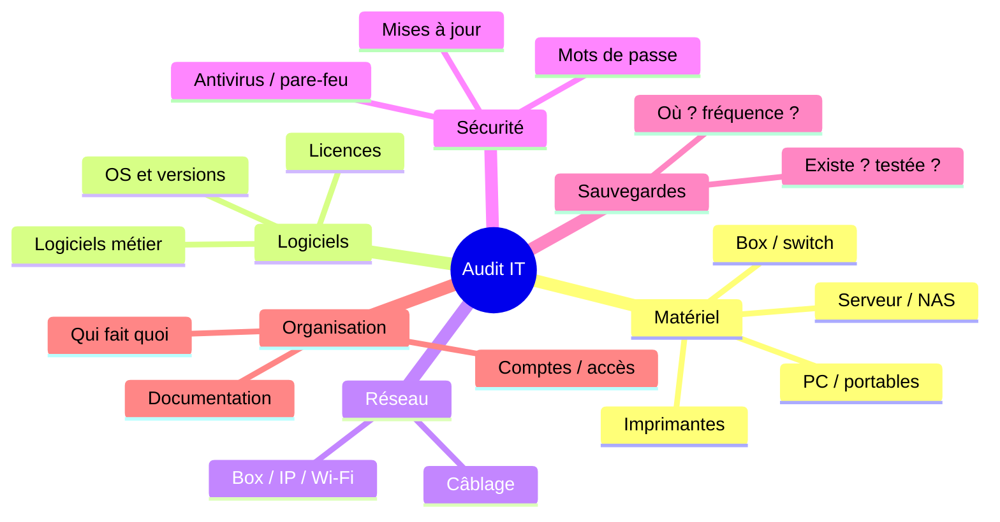

# Infogérance 02 — L'audit IT du client

🕐 Lecture : ~7 min · ⭐ Étape clé

---

## 🔍 L'analogie du quotidien

L'audit, c'est le **bilan de santé complet** avant de devenir le médecin de famille.
On examine **tout**, on note **tout**, on repère ce qui va et ce qui est malade. Sans
ce bilan, impossible de proposer un bon « traitement » (ni un bon prix).

---

## 🎯 À quoi sert l'audit

- **Pour toi** : connaître ce que tu vas devoir gérer (et éviter les mauvaises
  surprises après signature).
- **Pour le client** : une photo claire de son informatique, souvent la première de sa
  vie. C'est déjà un **livrable qui a de la valeur**.
- **Commercialement** : l'audit **crée le besoin**. En montrant les risques (pas de
  sauvegarde testée, matériel obsolète…), tu justifies le contrat.

> 💡 Beaucoup d'infogéreurs proposent l'audit **gratuit ou à petit prix** comme produit
> d'appel. C'est un excellent moyen d'entrer chez le client.

---

## 📋 Ce qu'on inventorie (les 6 domaines)

Utilise la [fiche d'audit](modeles/modele-fiche-audit.md) pour tout cocher. Les
domaines :

### 1. Matériel
Chaque PC (âge, état, système), serveurs, NAS, imprimantes, box, switchs. **Note les
numéros de série** et l'âge : un PC de 8 ans sous Windows obsolète = un risque à
signaler.

### 2. Logiciels
Systèmes d'exploitation et **versions** (un Windows en fin de vie = danger), logiciels
métier, et surtout l'état des **licences** (en règle ou pas ?).

### 3. Réseau
Plan d'adressage, Wi-Fi (chiffrement ?), câblage, débit internet.

### 4. Sécurité
Antivirus actif ? Pare-feu ? Mots de passe par défaut ? Mises à jour faites ?
Double authentification ?

### 5. Sauvegardes
**Le point le plus important.** Existe-t-il des sauvegardes ? Où ? À quelle fréquence ?
**Ont-elles déjà été testées ?** (Très souvent : non.)

### 6. Organisation
Qui gère quoi, quels comptes existent, y a-t-il une documentation ?

---

## 🚦 Classer ce que tu trouves

Pour le rapport, range chaque constat en 3 niveaux :

- 🔴 **Critique** : danger immédiat (pas de sauvegarde, Windows obsolète, pas d'antivirus).
- 🟠 **À améliorer** : fonctionne mais fragile (mots de passe faibles, matériel vieillissant).
- 🟢 **Correct** : rien à signaler.

> 💡 Ce code couleur rend ton rapport **lisible en 10 secondes** par un patron pressé.

---

## ✅ Ce qu'il faut retenir

1. L'audit = le **bilan de santé complet** : on inventorie 6 domaines, on note tout.
2. Le point **le plus critique** à vérifier : **les sauvegardes (existent + testées)**.
3. Classe tes constats en 🔴 **critique** / 🟠 **à améliorer** / 🟢 **correct**.

## 🔧 À essayer

Fais l'audit de **ta propre installation** (ou celle d'un proche) avec la
[fiche d'audit](modeles/modele-fiche-audit.md). Remplis les 6 domaines et attribue un
code couleur à chaque point. Combien de 🔴 trouves-tu ? Tu verras : il y en a toujours.

---

⬅️ [Infogérance 01](01-premier-contact-prospection.md) · ➡️ [Infogérance 03 — Rapport & devis](03-rapport-et-devis.md)
