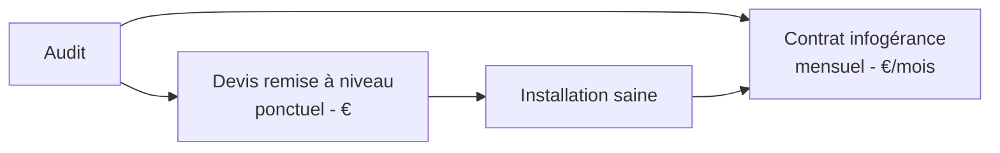

# Infogérance 03 — Rapport d'audit & devis

🕐 Lecture : ~6 min

---

## 📑 L'analogie du quotidien

Après le bilan de santé, le médecin ne te laisse pas avec des analyses brutes : il
t'**explique** ce qui va, ce qui ne va pas, et **ce qu'il propose**. Ton rapport
d'audit, c'est pareil : traduire la technique en **langage de patron**, puis chiffrer.

---

## 📝 Le rapport d'audit : clair et sans jargon

Règle d'or : **le patron doit tout comprendre sans toi.** Utilise le
[modèle de rapport](modeles/modele-rapport-audit.md). Structure gagnante :

> 🧰 **Gagne du temps** : les outils d'audit (Lansweeper, GLPI, PingCastle…) **exportent
> déjà un rapport technique**. Tu n'as plus qu'à en tirer la **synthèse en langage client**
> et l'intégrer. Voir [outils → Audit & inventaire client](../outils/#15-audit--inventaire-client-découverte-du-parc).

1. **Synthèse en 1 page** : les 3-4 risques majeurs en 🔴, en français simple.
   - ❌ « Le NAS n'a pas de réplication off-site »
   - ✅ « Aucune copie de vos données hors du bureau : en cas d'incendie ou de vol,
     tout est perdu. »
2. **Détail par domaine** (les 6 de l'audit), avec les codes couleur.
3. **Recommandations** classées par priorité : d'abord le 🔴, puis le 🟠.
4. **Ce que ça coûte de ne rien faire** (le risque chiffré : combien coûte 1 journée
   d'arrêt ? la perte des données clients ?).

> 💡 Vendre de l'info, c'est vendre de la **tranquillité** et de la **réduction de
> risque**, pas des boîtiers. Parle **conséquences business**, pas marques.

---

## 💶 Le devis : deux temps distincts

Ne mélange pas deux choses :

### 1. La **remise à niveau** (one-shot, ponctuel)
Corriger les 🔴 et 🟠 de l'audit : mettre en place une sauvegarde, remplacer un PC
obsolète, sécuriser le Wi-Fi… Chiffré **une fois**, en matériel + main-d'œuvre.

### 2. L'**infogérance** (le contrat mensuel récurrent)
La gestion dans la durée : supervision, maintenance, support, mises à jour…
Chiffré **par mois** (le vrai sujet du module 04 et 05).

> 💡 Idéalement : on **remet à niveau d'abord** (pour partir sur une base saine), puis
> on **enchaîne sur le contrat mensuel**. Tu ne veux pas t'engager à maintenir une
> install pourrie à prix fixe.

---

## 🎁 Présenter en 3 formules (astuce qui marche)

Propose souvent **3 niveaux** (ex : Essentiel / Confort / Sérénité). Le client se
concentre sur « lequel je prends » plutôt que « est-ce que je prends ». La formule du
milieu est souvent choisie.

---

## ✅ Ce qu'il faut retenir

1. Le rapport doit être **compris sans toi** : français simple, risques en conséquences
   business.
2. Sépare **remise à niveau (ponctuel)** et **infogérance (mensuel)**.
3. Propose plusieurs **formules** : le client choisit *laquelle*, pas *si*.

## 🔧 À essayer

Reprends l'audit de ton « À essayer » précédent. Rédige la **synthèse 1 page** : écris
tes 3 risques majeurs **en langage de patron** (conséquence concrète, zéro jargon).
Relis-toi : un non-informaticien comprendrait-il ?

---

⬅️ [Infogérance 02](02-audit-client.md) · ➡️ [Infogérance 04 — Contrat & SLA](04-contrat-mensuel-sla.md)
