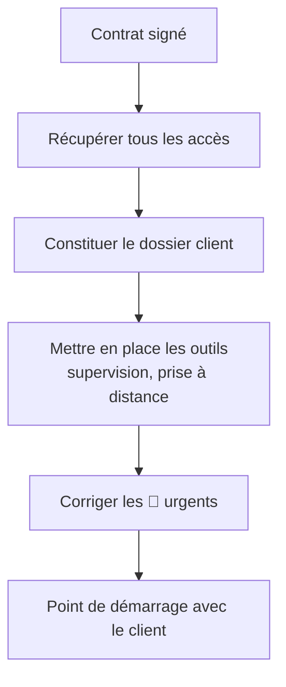

# Infogérance 06 — L'onboarding client

🕐 Lecture : ~6 min

---

## 🛫 L'analogie du quotidien

L'onboarding, c'est la **prise en main des clés** quand tu deviens gardien d'un nouvel
immeuble. Avant de pouvoir intervenir efficacement, il te faut **toutes les clés, tous
les plans, et savoir qui habite où**. Un onboarding bâclé = tu galères à chaque
intervention pendant des mois.

> 💡 C'est le moment qui fait la différence entre un infogéreur **pro** et un bricoleur.

---

## 📅 Les 30 premiers jours : le plan

---

## 🔑 1. Récupérer **tous** les accès

Fais la liste et récupère **tout** (puis **change les mots de passe** et range-les dans
ton coffre — voir exploitation/06) :

- Accès **admin** des PC et du serveur
- Interface de la **box** / du pare-feu
- **NAS** (compte admin)
- Comptes **Microsoft 365 / Google Workspace**
- Accès **fournisseurs** (nom de domaine, hébergeur, opérateur, logiciel métier)
- Comptes des **licences** et abonnements

> ⚠️ Un client qui ne retrouve pas ses accès, c'est fréquent. Note ce qui manque : le
> récupérer fait **partie de l'onboarding**.

> 🏷️ **Au nom de qui ?** Les comptes, licences, le **domaine** et le **tenant M365** doivent
> être **au nom du client** (toi = accès admin), jamais sur ton compte perso. Profite de
> l'onboarding pour **corriger** ceux qui seraient mal déclarés. Détails :
> [exploitation 06 — au nom de qui ?](../exploitation/06-gestion-acces-mots-de-passe.md#au-nom-de-qui--propriété-des-licences).

---

## 📂 2. Constituer le dossier client

Le **« classeur »** de ce client, que tu tiendras à jour en permanence (voir le
[modèle de dossier client](../exploitation/modeles/modele-dossier-client.md)) :

- Inventaire matériel + logiciel (issu de l'audit)
- Plan réseau (IP, Wi-Fi, matériel)
- Liste des accès (dans le coffre, référencés ici)
- Contacts (dirigeant, référent interne, fournisseurs)
- Le contrat et son périmètre

> 💡 Objectif : **si tu tombes malade, un collègue doit pouvoir reprendre** le client
> avec ce dossier. C'est le test ultime d'un bon dossier.

---

## 🛠️ 3. Déployer tes outils

- **Supervision / RMM** sur les machines (être alerté avant la panne).
- **Prise en main à distance** (pour dépanner sans te déplacer).
- **Sauvegarde managée** si elle fait partie du contrat.

(Tout ça est détaillé dans la section [Exploitation](../exploitation/).)

---

## 🚑 4. Corriger les urgences (🔴)

Traite d'abord les risques critiques de l'audit : mettre en place une sauvegarde si elle
manque, sécuriser ce qui est ouvert. **Les quick wins visibles** rassurent le client dès
le début.

---

## 🤝 5. Le point de démarrage

Un court rendez-vous pour : présenter **comment on travaille** (comment ils te
contactent, les délais SLA), désigner un **référent interne**, et expliquer le
**helpdesk** (comment ouvrir un ticket).

---

## ✅ Ce qu'il faut retenir

1. Récupère **tous les accès**, change les mots de passe, range-les dans ton **coffre**.
2. Monte le **dossier client** : si un collègue devait reprendre, il le pourrait.
3. Déploie tes **outils** (supervision, prise à distance) et traite les **🔴 urgents**
   en premier.

## 🔧 À essayer

Crée le **dossier client** d'un client fictif à partir du
[modèle](../exploitation/modeles/modele-dossier-client.md) : remplis les sections
inventaire, réseau et contacts. Garde ce fichier : tu réutiliseras ce format pour
chaque vrai client.

---

⬅️ [Infogérance 05](05-tarification.md) · 🏁 [Section infogérance](README.md) · ➡️ [Exploitation au quotidien](../exploitation/)
