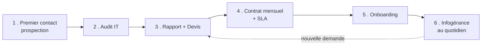

# 💼 Métier d'infogérance — du premier contact au contrat mensuel

Cette section n'est plus de la **technique** : c'est le **métier**. Comment on passe
d'un inconnu à un **client sous contrat mensuel** qui te paie chaque mois pour gérer
son informatique.

> 🎯 Objectif : savoir **décrocher un client, l'auditer, le chiffrer, le contractualiser
> et le démarrer** proprement. C'est ça, l'infogérance.

---

## 🔄 Le cycle de vie d'un client (vue d'ensemble)

Chaque étape a son module ci-dessous. **Suis-les dans l'ordre** : c'est le chemin
réel d'une mission d'infogérance.

---

## 📚 Les modules

| # | Module | Ce que tu apprends |
|---|---|---|
| 01 | [Premier contact & prospection](01-premier-contact-prospection.md) | Trouver et aborder un client |
| 02 | [L'audit IT du client](02-audit-client.md) | Faire l'état des lieux complet |
| 03 | [Rapport d'audit & devis](03-rapport-et-devis.md) | Restituer et chiffrer |
| 04 | [Le contrat mensuel & les SLA](04-contrat-mensuel-sla.md) | Contractualiser proprement |
| 05 | [La tarification](05-tarification.md) | Fixer tes prix sans te tromper |
| 06 | [L'onboarding client](06-onboarding-client.md) | Démarrer la mission sans trou |

---

## 📎 Les modèles prêts à remplir

Dans [`modeles/`](modeles/) : des documents que tu copies et remplis pour chaque client.

| Modèle | Usage |
|---|---|
| [Fiche d'audit](modeles/modele-fiche-audit.md) | Pendant l'audit, pour ne rien oublier |
| [Rapport d'audit](modeles/modele-rapport-audit.md) | Restitution au client |
| [Devis](modeles/modele-devis.md) | Proposition chiffrée |
| [Contrat d'infogérance](modeles/modele-contrat-infogerance.md) | Le contrat mensuel type |
| [Fiche d'intervention](modeles/modele-fiche-intervention.md) | Compte-rendu après chaque passage |
| [Checklist onboarding poste](modeles/modele-onboarding-poste.md) | Installer un nouveau poste |

> ⚠️ **Important** : ces modèles sont **pédagogiques**. Avant d'utiliser un contrat
> pour de vrai, fais-le **relire par un juriste / un expert-comptable**. Un contrat mal
> ficelé peut te coûter très cher.

---

⬅️ [Retour au sommaire](../README.md)
